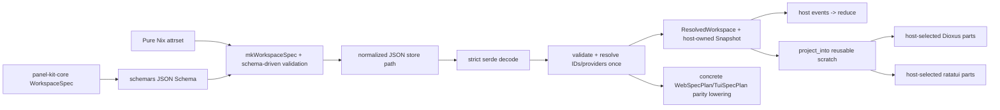

# panel-kit library-ness and feature-complete pure-Nix `WorkspaceSpec`

## Status, scope, and normative direction

This is the final synthesized implementation specification for a `/plan-task` → `/implement-task` TDD pipeline. It is design-only: it does not claim that any code, check, example, or consumer migration has been implemented or run.

The selected runtime architecture is Solution B's host-owned state, event reducer, borrowed frame projection, and backend widget kits (Solution B §§2–7). The interchange and check architecture takes Solution C's Rust-authoritative `WorkspaceSpec`, `schemars` export, store-path JSON delivery, and native crane/Hydra mechanics (Solution C §§3.2, 4.1, 5). Solution A supplies the copyable `PanelKey`/`SpecPanelId` resolution, `LayoutStore::clear`, `SavePolicy`, JSON-pointer diagnostics, retained `mkLayout`, and finer-grained web parts (Solution A §§4.1, 5, 6, 11).

The implementation is a clean major-version cutover. Both backend controller types are deleted. No compatibility controller, deprecated alias, old-path re-export, or second renderer is retained.

## 1. Evaluation evidence and synthesis strategy

### 1.1 Consensus strengths

| Consensus | Evidence from evaluation | Consequence here |
| --- | --- | --- |
| Host-owned state and control flow are the strongest library boundary. | Judges 1 and 3 voted for B; Judge 1 scored B 5.0 for inversion-of-control removal and emphasized app first refusal on events (report 1 §§2.5, 5.3). Judge 3 called B the best IoC/economy balance (report 3 §§4.2, 6–7). | Adopt B's plain `Snapshot<K>`, free `reduce`, free partial projectors, and deletion of both controllers. |
| Borrowed reusable projection is required, not an owned projection allocated every frame. | Judges verified the web clone/collection at `src/lib.rs:776-789` and TUI scratch vectors at `crates/panel-kit-tui/src/lib.rs:389-440,617-641`; Judge 3 applied an allocation pitfall only to A (report 3 §§3, 4.11). | Adopt B's `ProjectionBuffer` and borrowed `ProjectedFrame`; add an allocator-counted steady-state test. |
| Backends must retain native semantics rather than consume a lowest-common-denominator paint tape. | B was praised for retaining ratatui `Block::title`/`inner`, semantic DOM, CSS Grid, native focus, and scroll behavior (reports 1 §2.5 and 3 §7). | Frame data is semantic geometry/state only. Native painters remain in backend crates. |
| The Rust type must decide parity, and all three field-drift directions must fail. | Judges 1 and 2 explicitly identified A's missing `deny_unknown_fields`; B and C caught Nix-only and Rust-only drift (report 1 §§1.2, 5.3; report 2 §§2, 7–8). | All serialized structs are strict; schema, normalized values, exact provider sets, and backend lowering are checked. |
| C has the only complete build-feasibility story. | All judges ranked C highest for parity feasibility because it names a separate native crane argument set without `CARGO_BUILD_TARGET`, feature-gated tooling, store-path input, and Hydra aggregation (reports 1 §§3.4–3.5; 2 §§5, 7; 3 §§4.5, 6). | Adopt those mechanics verbatim in §11. |
| Existing layout-only Nix remains useful. | Judges 2 and 3 warned that C deletes `mkLayout` without a `SavedLayoutV2` successor (report 2 §7 borrowable 3; report 3 §8 C weakness 2). | Retain `mkLayout` as the layout-only entry point beside `mkWorkspaceSpec`. |
| Persistence timing needs a behavioral contract. | Judges 1 and 3 asked B to absorb A's `clear` and fake-store write-count tests (report 1 §5.3; report 3 §6 borrowables 5–6). | Promote `LayoutStore` to core with `clear`; define `SavePolicy` and exact transition semantics. |

### 1.2 Consensus weaknesses corrected

1. **A's unknown-field hole:** every `WorkspaceSpec` struct uses `#[serde(deny_unknown_fields)]`; normalized nullable values are required rather than silently omitted.
2. **A's hot-path allocation:** no `Vec` is returned by projection. `ProjectionBuffer` owns reusable capacity, and `ProjectedFrame` borrows it.
3. **B's unaccounted native runner:** §11 defines host-target crane arguments, a host cargo-test check, check-only fileset additions, store-path inputs, and both Hydra systems.
4. **B's underspecified single-panel path:** §5.3 fully enumerates `PanelProjectionInput` and gives web and TUI compositions using it.
5. **C's abstraction stack:** there is no `BackendPlan` trait, `ParityProjection` trait, `CapabilitySet`, `CatalogHandle`, or public semantic-manifest API. The checker calls two concrete backend lowering functions and inspects private plan projections.
6. **C's lost resize behavior:** `WorkspaceEvent::ViewportChanged` plus `ResizePolicy` explicitly owns the current ratio-scaling choice, while a web `observe_viewport` adapter only reports measurements.
7. **C's `mkLayout` deletion:** rejected; the existing public layout-only API stays.
8. **Missing CI for unit tests:** `checks.core-unit-tests` is a native crane cargo-test job; it is not hidden behind the wasm build's `doCheck = false`.
9. **Missing viewport row and focus token:** the completeness table includes `surface.resize_policy`; the color contract includes `focus_ring`, currently present at `assets/panel-kit.css:21`.
10. **Misplaced badge tests:** tests of core `tag_hue`/label behavior currently in `src/badge.rs:272-300` move to the core badge module; web tests cover only observable Dioxus rendering/action behavior.

### 1.3 Disagreements and evidence-based resolution

- **B versus C as the base:** B won two votes and had the best average runtime/economy result; C had the highest parity-feasibility score. The repository's visible render-time cloning and backend controller ownership support B for runtime, while the flake's wasm pin, `doCheck = false`, and fileset exclusion support C for build mechanics. The synthesis therefore uses B for runtime and C for the check path rather than inventing a fourth architecture.
- **Delete or retain `PanelKind`:** B deletes the trait; A and C preserve an enum convenience path. The live trait's `Copy` and static-title contract (`crates/panel-kit-core/src/lib.rs:31-43`) is useful to plain Rust callers but cannot represent Nix-owned runtime strings. Keep it, add a narrower `PanelKey`, and resolve strings once to `SpecPanelId`.
- **One Nix author versus dual authored fixtures:** B/C delete the geometry mirror, whereas A permanently compares two full authored specs. The live seven-versus-nine failure shows that permanent mirroring is the wrong ownership model. Nix becomes the sole canary layout/metadata author; Rust retains an exact executable-provider manifest, which is complementary rather than duplicated geometry.
- **How much schema machinery:** C's schema-derived leaf coverage catches fixture-blind and backend-ignores-field drift, but its public trait stack is unnecessary. Keep the falsifier and make it private tooling over concrete `WebSpecPlan`/`TuiSpecPlan` values.

## 2. Problem statement with verified working-tree evidence

The repository already has a strong renderer-neutral core. It contains `PanelKind`, `SurfaceProfile`/`effective_mode`, the keyboard command vocabulary, workspace chrome geometry, `PanelWin`, drag/reorder/restore operations, and V1/V2 persistence and reconciliation (`crates/panel-kit-core/src/lib.rs:31-165,167-332,406-459,502-544,717-851,870-1077`). These are existing inputs, not proposed features.

The remaining public adoption path is framework-shaped:

- Web `Workspace<K>` owns eight public Dioxus signals and a private focus signal; `use_workspace` requires `storage_key: &'static str` and `defaults: fn()`, installs resize/persistence effects, and returns the controller (`src/lib.rs:293-470`). The function pointer blocks capturing runtime configuration; the static key blocks owned/runtime keys.
- Web persistence is private and hardwired to `gloo_storage::LocalStorage` (`src/lib.rs:96,249-283`).
- `Workspace::render` is the only all-panel paint path and clones the panel vector plus collects visible indices on each render (`src/lib.rs:766-930`, especially `:776-789`). Its header is private and the dock is a controller method (`src/lib.rs:932-1006,1024-1069`). An application cannot paint one panel surface, omit only traffic lights, or replace only the dock.
- `TuiWorkspace<K>` similarly owns state, persistence, theme, hit maps, charset, scrolling, and rendering (`crates/panel-kit-tui/src/lib.rs:186-222`). Its renderer builds scratch vectors and paints root, layout, panels, native `Block` titles, dock, and scrollbar in one method (`crates/panel-kit-tui/src/lib.rs:335-660`).
- `LayoutStore` already exists, but in the TUI backend, with a private file adapter (`crates/panel-kit-tui/src/lib.rs:144-171`). Cross-backend persistence belongs in core under the repository rule (`AGENTS.md:3-23`).

The Nix surface and its proof are incomplete:

- `mkLayout` correctly emits `SavedLayoutV2` geometry/state and validates layout bounds (`nix/lib/mkLayout.nix:1-28,71-135`). It is publicly exported for downstream flakes (`flake.nix:111-116`), but it does not describe theme, chrome, input, content, or persistence policy.
- The current Nix canary claims to mirror the Rust canary but lists seven panels (`nix/examples/workspace-canary.nix:1-6,24-32`). Rust `defaults()` lists nine and inserts `Flame` and `Distribution`; later coordinates differ as well (`crates/panel-kit-tui/examples/workspace_canary.rs:7-50`).
- `checks.layout-canary-schema` only checks the Nix JSON with `jq` and explicitly expects seven panels (`flake.nix:118-149`). It is green while parity is false.

The cross-backend data contract is also asymmetric:

- CSS has fifteen named palette colors plus `--focus-ring`, geometry, and font tokens (`assets/panel-kit.css:5-29`); TUI `Theme` carries thirteen colors and separate dark/paper literals (`crates/panel-kit-tui/src/theme.rs:7-80`); `DESIGN.md` repeats palette and typography values (`DESIGN.md:4-63`).
- Core owns badge meaning, but web exposes the larger data surface and TUI owns a second smaller data type (`src/badge.rs:59-160`; `crates/panel-kit-tui/src/badge.rs:11-101`). TUI-only modules contain chart/table/meter/status/scroll models (`crates/panel-kit-tui/src/lib.rs:35-44`; representative chart types at `crates/panel-kit-tui/src/charts.rs:29-35,103-113,163-181,310-362`).

The target is therefore not more controller methods. It is an ownership reversal: the host owns state, event ordering, effects, and render order; core owns renderer-neutral transitions and projection; backends expose independently callable native painters; and a strict, Rust-authoritative `WorkspaceSpec` may be authored in pure Nix at build time.

## 3. Target architecture

### 3.1 Crate and module layout

```text
crates/panel-kit-core/src/
  lib.rs                 narrow re-exports; existing primitives retained
  panel.rs               PanelKey, SpecPanelId, PanelMeta, concrete PanelCatalog
  reducer.rs             Snapshot, events, ReduceContext, Reduction, reduce
  frame.rs               ProjectionBuffer, borrowed frame, partial projectors, hit_test
  persist.rs             promoted LayoutStore, SavePolicy, shared V1/V2 lifecycle
  spec.rs                authoritative WorkspaceSpec, validation, resolution
  theme.rs               Color, ColorRef, ThemeTokens, dark/paper defaults
  widgets/
    mod.rs                ContentSpec/DataSource and borrowed runtime views
    badge.rs              BadgeSpec plus existing badge semantics
    charts.rs             series/gauge/flame/boxplot models and shared calculations
    table.rs              semantic cells and widths
    meter.rs status.rs scroll.rs spinner.rs

src/                     panel-kit: Dioxus backend only
  lib.rs                 backend re-exports; no Workspace controller
  input.rs               DOM events/focus/wheel -> core events
  surface.rs             observe_viewport callback adapter
  store.rs               LocalStorageLayoutStore
  spec_plan.rs             pure WebSpecPlan/lower_spec; no DOM/web-sys types
  theme.rs               ThemeTokens -> CSS custom properties
  widgets/
    root.rs panel.rs dock.rs badge.rs charts.rs table.rs meter.rs status.rs scroll.rs spinner.rs

crates/panel-kit-tui/src/
  lib.rs                 backend re-exports; no TuiWorkspace controller
  input.rs               crossterm/ratzilla -> core events; hit-test adapter
  store.rs               JsonFileLayoutStore
  theme.rs               ThemeTokens -> ratatui colors only; no default literals
  widgets/
    root.rs panel.rs dock.rs badge.rs charts.rs table.rs meter.rs status.rs scroll.rs spinner.rs

tools/spec-parity/
  Cargo.toml              unpublished workspace member
  src/main.rs             schema export, strict compare, concrete backend-plan matrix

nix/lib/
  mkLayout.nix            retained layout-only SavedLayoutV2 API
  mkWorkspaceSpec.nix     full pure-Nix authoring/normalization function
  validateSchema.nix      recursive validator for the schemars subset emitted here
nix/schema/
  workspace-spec.schema.json  generated from Rust, checked, never hand-edited
nix/specs/
  web-workspace.nix
  workspace-canary.nix    authoritative nine-panel canary
```

No renderer-neutral platform trait and no new framework crate are added. `tools/spec-parity` is the only new crate; it is justified because checking concrete web and TUI lowered plans from one native executable would create a dependency cycle if placed in core.

`panel-kit-core` keeps both additions opt-in: `spec-json` enables JSON decode/encode helpers and optional `serde_json`; `spec-schema` enables optional `schemars` and schema export (and implies `spec-json`). Neither is a default feature. The data types and Rust constructors themselves remain available without either feature.

The root package gains `default = ["web-runtime"]`. `web-runtime` enables the existing Dioxus, gloo-storage, wasm-bindgen, and web-sys dependencies and painter/input/store modules. `spec-plan` enables only `panel-kit-core/spec-json` plus `src/spec_plan.rs`; the native checker depends on `panel-kit` with `default-features = false, features = ["spec-plan"]`. `WebSpecPlan` contains only owned core/scalar configuration and is consumed by the production web painters when `web-runtime` is enabled. Thus `web::lower_spec` is concrete production lowering, not a checker duplicate, while the native checker does not link a browser runtime. `panel-kit-tui::spec_plan` is natively compilable already and follows the same “one plan consumed by painters” rule.

### 3.2 Ownership and dependency rules

1. `panel-kit-core` may not depend on Dioxus, ratatui, browser APIs, filesystem APIs, or Nix.
2. `Snapshot` is plain host-owned data. A host may keep it in a Dioxus `Signal`, a crossterm loop struct, an ECS resource, or separate fields.
3. `reduce` performs no I/O and invokes no callback.
4. `project_into` writes into caller-owned scratch and returns a frame borrowing only that scratch.
5. Backends translate native input and paint semantic parts; native focus, scrolling, widgets, DOM/ARIA, CSS Grid, ratatui `Block`, and cell rounding remain backend-local.
6. `WorkspaceSpec` is optional. Plain Rust callers may begin at `PanelCatalog` + `Snapshot`, or use existing geometry/free functions directly.
7. Nix evaluation occurs only in flake evaluation/builds. No application invokes Nix or requires a Nix store at runtime.

## 4. Panel identity and host-owned state

### 4.1 Closed enum compatibility and Nix-resolved IDs

```rust
pub trait PanelKey: Copy + Eq + std::hash::Hash + 'static {}

impl<T: PanelKind + 'static> PanelKey for T {}

#[derive(Clone, Copy, Debug, PartialEq, Eq, Hash)]
pub struct SpecPanelId(u32);

impl PanelKey for SpecPanelId {}

pub struct PanelMeta<K: PanelKey> {
    pub key: K,
    pub stable_id: Box<str>,
    pub title: Box<str>,
    pub slug: Box<str>,
    pub content: ContentSpec,
}

pub struct PanelCatalog<K: PanelKey> {
    entries: Box<[PanelMeta<K>]>,
    by_key: HashMap<K, usize>,
    by_stable_id: HashMap<Box<str>, usize>,
}

impl<K: PanelKey> PanelCatalog<K> {
    pub fn try_new(entries: Vec<PanelMeta<K>>) -> Result<Self, CatalogError>;
    pub fn get(&self, key: K) -> Option<&PanelMeta<K>>;
    pub fn get_by_stable_id(&self, id: &str) -> Option<&PanelMeta<K>>;
    pub fn stable_id(&self, key: K) -> Option<&str>;
    pub fn len(&self) -> usize;
}
```

`PanelKind` remains the source-compatible convenience for hand-written fieldless enums and static titles. `PanelKey` is the narrower bound used by reducers/projection. A `String` cannot satisfy the current `Copy` contract and a runtime title cannot satisfy `PanelKind::title() -> &'static str` (`crates/panel-kit-core/src/lib.rs:31-43`), so Nix IDs are validated and interned once into ordered `SpecPanelId` indices.

Numeric indices never serialize or persist. `PanelCatalog` maps every key to a stable string when saving and maps strings back when restoring; persistence APIs therefore do not require `PanelKey: Serialize`. Existing enum consumers use stable IDs identical to their current serde variant names, preserving V1/V2 JSON. Unknown saved IDs are ignored; newly declared IDs are appended from defaults through the existing merge behavior.

### 4.2 Snapshot and reducer

```rust
#[derive(Clone, Copy, Debug, PartialEq)]
pub struct Viewport {
    pub width: f64,
    pub height: f64,
    pub units: Units,
}

#[derive(Clone, PartialEq)]
pub struct Snapshot<K: PanelKey> {
    pub panels: Vec<PanelWin<K>>,
    pub preferred_mode: Mode,
    pub viewport: Viewport,
    pub focused: Option<K>,
    pub drag: Option<Drag>,
    pub tile_drag: Option<K>,
    pub workspace_scroll: f64,
}

impl<K: PanelKey> Snapshot<K> {
    pub fn from_defaults(
        panels: Vec<PanelWin<K>>,
        preferred_mode: Mode,
        viewport: Viewport,
    ) -> Self;
}

#[derive(Clone, Copy, Debug, PartialEq, Eq)]
pub enum PanelPart {
    Surface,
    Header,
    ModeControl,
    MinimizeControl,
    MaximizeControl,
    ResizeGrip,
}

#[derive(Clone, Copy, Debug, PartialEq)]
pub enum HitTarget<K: PanelKey> {
    Workspace,
    Panel { key: K, part: PanelPart },
    Dock { key: K },
}

#[derive(Clone, Copy, Debug, PartialEq, Eq, Serialize, Deserialize, JsonSchema)]
#[serde(rename_all = "snake_case")]
pub enum ResizePolicy {
    PreserveIntent,
    ScaleFloating,
}

#[derive(Clone, Copy, Debug, PartialEq, Eq)]
pub enum WheelDisposition {
    ContentConsumed,
    BubbleToWorkspace,
}

#[derive(Clone, Debug, PartialEq)]
pub enum WorkspaceEvent<K: PanelKey> {
    Pointer { target: HitTarget<K>, event: PointerEvent },
    Key { chord: KeyChord, focus: FocusContext<K> },
    Command { target: Option<K>, command: PanelCommand },
    Wheel { delta_y: f64, disposition: WheelDisposition },
    ViewportChanged(Viewport),
}

pub struct ReduceContext<'a> {
    pub surface: SurfaceProfile,
    pub clamp: &'a Clamp,
    pub tile: &'a TileMetrics,
    pub tile_grid: Option<TileGridProjection>,
    pub command_step: CommandStep,
    pub resize_policy: ResizePolicy,
}

#[derive(Clone, Copy, Debug, PartialEq, Eq)]
pub enum ChangePhase { Continuous, Settled }

#[derive(Clone, Debug, PartialEq)]
pub struct Reduction<K: PanelKey> {
    pub changed: bool,
    pub phase: Option<ChangePhase>,
    pub focus_request: Option<K>,
}

pub fn reduce<K: PanelKey>(
    snapshot: &mut Snapshot<K>,
    event: WorkspaceEvent<K>,
    context: ReduceContext<'_>,
) -> Reduction<K>;
```

Reducer rules:

- Key events reuse `command_for`; commands reuse `apply_command`. Pointer paths reuse `begin_drag`, `begin_tile_resize`, `apply_drag`, `reorder_tile`, and `restore` rather than duplicating them.
- Pointer motion and hover reorder are `Continuous`; pointer-up, commands, dock restore, wheel changes, and a valid viewport change are `Settled`.
- `WheelDisposition::ContentConsumed` is a no-op. The DOM/TUI body decides whether native content consumed the wheel; core only owns workspace scrolling. This preserves the current web wheel chain (`src/lib.rs:728-754`).
- `ViewportChanged` rejects non-finite/non-positive dimensions. `ScaleFloating` applies the current reversible viewport ratio policy (`src/lib.rs:372-397`); `PreserveIntent` only updates viewport/profile. The web `observe_viewport` adapter reports measurements and does not own state.
- Invalid indices/targets are no-ops, not panics. `Reduction` reports effects; it performs none.
- Existing free functions remain public. A caller may use one directly without constructing `Snapshot` or `WorkspaceEvent`.

## 5. Single-sourced geometry and borrowed frame projection

### 5.1 Public frame shape

```rust
#[derive(Clone, Copy, Debug, PartialEq, Eq)]
pub enum FrameStatus {
    Ready,
    TooSmall,
}

#[derive(Clone, Copy, Debug, PartialEq)]
pub enum Placement {
    Floating,
    Tiled { column: u8, row: u16, column_span: u8, row_span: u8 },
    Maximized,
}

#[derive(Clone, Copy, Debug, PartialEq)]
pub struct PanelChromeProjection {
    pub outer: Region,
    pub body: Region,
    pub header_hit: Region,
    pub mode_hit: Option<Region>,
    pub minimize_hit: Option<Region>,
    pub maximize_hit: Option<Region>,
    pub resize_hit: Option<Region>,
}

#[derive(Clone, Copy, Debug, PartialEq)]
pub struct TileLayoutMetrics {
    pub resize: TileMetrics,
    pub columns: u8,
    pub row_min: f64,
    pub gap: f64,
    pub padding: f64,
    pub fill_viewport: bool,
}

#[derive(Clone, Copy, Debug, PartialEq)]
pub struct TileGridProjection {
    pub columns: u8,
    pub rows: u16,
    pub track_w: f64,
    pub track_h: f64,
    pub gap: f64,
    pub padding: f64,
}

#[derive(Clone, Copy, Debug, PartialEq)]
pub struct PanelProjection<K: PanelKey> {
    pub source_index: usize,
    pub key: K,
    pub region: Region,
    pub placement: Placement,
    pub z: i32,
    pub state: WinState,
    pub focused: bool,
    pub pointer_dragging: bool,
    pub tile_dragging: bool,
    pub chrome: PanelChromeProjection,
}

#[derive(Clone, Copy, Debug, PartialEq)]
pub struct DockProjection<K: PanelKey> {
    pub source_index: usize,
    pub key: K,
    pub region: Region,
}

pub struct ProjectionBuffer<K: PanelKey> {
    panel_order: Vec<usize>,
    panels: Vec<PanelProjection<K>>,
    dock: Vec<DockProjection<K>>,
    tile_rows: Vec<TileRowScratch>,
}

impl<K: PanelKey> ProjectionBuffer<K> {
    pub fn with_panel_capacity(panels: usize) -> Self;
    pub fn reserve_panels(&mut self, additional: usize);
}

pub struct ProjectedFrame<'a, K: PanelKey> {
    pub status: FrameStatus,
    pub chrome: WorkspaceChrome,
    pub mode: Mode,
    pub surface: SurfaceProfile,
    pub tile_grid: Option<TileGridProjection>,
    pub content_extent: Region,
    pub workspace_scroll: f64,
    pub panels: &'a [PanelProjection<K>],
    pub dock: &'a [DockProjection<K>],
}

pub struct ProjectionInput<'a, K: PanelKey> {
    pub snapshot: &'a Snapshot<K>,
    pub surface: SurfaceProfile,
    pub chrome: &'a ChromeSpec,
    pub clamp: &'a Clamp,
    pub tile: &'a TileLayoutMetrics,
}

pub fn project_into<'frame, K: PanelKey>(
    input: ProjectionInput<'_, K>,
    scratch: &'frame mut ProjectionBuffer<K>,
) -> ProjectedFrame<'frame, K>;

pub fn hit_test<K: PanelKey>(
    frame: &ProjectedFrame<'_, K>,
    point: (f64, f64),
) -> Option<HitTarget<K>>;
```

The frame borrows only scratch storage. Keys and numeric projection records are copied; it does not retain a borrow of the mutable snapshot or catalog. This makes the frame compatible with an app-owned mutation loop while preventing it from outliving/reusing scratch during a second projection.

### 5.2 Allocation and geometry contract

`ProjectionBuffer::with_panel_capacity(snapshot.panels.len())` allocates once. Projection clears vector lengths while retaining capacity, fills index/numeric records, and sorts the index buffer in place. Steady-state `project_into` performs zero heap allocations, clones no `PanelWin`, string, title, slug, content model, or chart buffer, and does not format labels. Capacity may grow only when the panel/row count exceeds the reserved bound.

Floating paint order is `(z, source_index)`; tiling order is source order. Maximized projection emits only the deterministic frontmost maximized panel. Minimized panels appear only in the dock. Invalid/small viewports emit `FrameStatus::TooSmall` without negative/NaN rectangles.

Core computes tile row/column placement and track dimensions once. Web receives explicit CSS Grid placement and track values; TUI converts the same plan to cells. CSS Grid remains the DOM primitive, but it no longer invents auto-placement. The same `TileGridProjection` supplies span-resize deltas, eliminating projection/interaction disagreement. Floating projection retains `effective_rect`'s stored-intent behavior (`crates/panel-kit-core/src/lib.rs:659-674`).

A serial allocator-counted native unit test warms the buffer once, projects unchanged-capacity input repeatedly, and asserts zero subsequent allocations. A compile-fail doctest proves the frame cannot survive a second mutable borrow of its scratch.

### 5.3 Fully specified partial projectors

```rust
pub struct PanelProjectionInput<'a> {
    pub viewport: Region,
    pub preferred_mode: Mode,
    pub surface: SurfaceProfile,
    pub focused: bool,
    pub pointer_dragging: bool,
    pub tile_dragging: bool,
    pub workspace_scroll: f64,
    pub clamp: &'a Clamp,
    pub chrome: &'a ChromeSpec,
    pub tile_grid: Option<&'a TileGridProjection>,
    /// Required for an independently projected tiled panel. `None` means
    /// the standalone panel occupies tiled origin `(0, 0)`.
    pub tiled_origin: Option<(u8, u16)>,
}

pub fn project_panel<K: PanelKey>(
    panel: &PanelWin<K>,
    source_index: usize,
    input: PanelProjectionInput<'_>,
) -> Option<PanelProjection<K>>;

pub fn project_chrome(viewport: Viewport, metrics: &ChromeMetrics) -> WorkspaceChrome;

pub fn project_dock_into<K: PanelKey>(
    panels: &[PanelWin<K>],
    dock_region: Region,
    out: &mut Vec<DockProjection<K>>,
);
```

`project_panel` needs no `Snapshot`, catalog, dock, store, theme, backend, or full frame. When tiling is effective it uses the caller's `tiled_origin`, or `(0, 0)` for a genuinely standalone panel; it never guesses placement from unseen siblings. `project_dock_into` writes into caller-owned capacity. These functions are the anti-god-object contract, not secondary conveniences.

## 6. Backend composition parts and what replaces `render`

### 6.1 Dioxus parts

```rust
pub fn root_class(frame: &ProjectedFrame<'_, impl PanelKey>) -> &'static str;

pub fn panel_surface<K: PanelKey>(
    panel: PanelProjection<K>,
    class: Option<&str>,
    body: Element,
) -> Element;

pub fn panel_chrome<K: PanelKey>(
    panel: PanelProjection<K>,
    meta: &PanelMeta<K>,
    header_actions: Option<Element>,
) -> Element;

pub fn traffic_lights<K: PanelKey>(
    panel: PanelProjection<K>,
    emit: EventHandler<WorkspaceEvent<K>>,
) -> Element;

pub fn resize_grip<K: PanelKey>(
    panel: PanelProjection<K>,
    emit: EventHandler<WorkspaceEvent<K>>,
) -> Element;

pub fn dock<K: PanelKey>(
    items: &[DockProjection<K>],
    catalog: &PanelCatalog<K>,
    emit: EventHandler<WorkspaceEvent<K>>,
) -> Element;

pub fn observe_viewport(emit: EventHandler<Viewport>);
pub struct LocalStorageLayoutStore { /* owned String key */ }
impl LocalStorageLayoutStore {
    pub fn new(key: impl Into<String>) -> Self;
}
```

`panel_surface` draws the section/border/body bounds only. It never calls `panel_chrome`, `traffic_lights`, `resize_grip`, or `dock`. `panel_chrome` retains semantic toolbar/ARIA/focus behavior; `.panel-body` retains native `overflow:auto`; the input adapter observes DOM scrollability and emits `WheelDisposition`. Header actions remain an application-owned `Element`.

There is no replacement `render` method. A complete workspace is an example loop over `frame.panels`, calling the parts the host chooses, followed by an optional dock call. The host receives native events first and forwards only unconsumed ones.

Dioxus borrowing is render-scoped: a component stores `ProjectionBuffer` in a non-reactive `RefCell`/hook, borrows it mutably, calls `project_into`, immediately calls plain painter functions to produce owning `Element` values, and drops the frame/scratch guard before any event mutation. `ProjectedFrame` is never placed in a signal, memo, component prop, or retained closure. This preserves B's borrowed lifetime without recreating a controller or adding an owned frame allocation.

### 6.2 Ratatui parts

```rust
/// Reusable, caller-owned hit-test storage; painters clear lengths but retain capacity.
pub struct TuiHitBuffer<K: PanelKey> { /* control and dock hit records */ }

pub fn draw_root(frame: &mut Frame, projection: &ProjectedFrame<'_, impl PanelKey>, theme: &ResolvedTuiTheme);

pub fn draw_panel_surface<K: PanelKey>(
    frame: &mut Frame,
    panel: PanelProjection<K>,
    theme: &ResolvedTuiTheme,
    charset: Charset,
) -> Rect;

pub fn draw_panel_chrome<K: PanelKey>(
    frame: &mut Frame,
    panel: PanelProjection<K>,
    meta: &PanelMeta<K>,
    theme: &ResolvedTuiTheme,
    charset: Charset,
) -> TuiChromeHits;

pub fn draw_traffic_lights<K: PanelKey>(...) -> TuiControlHits;
pub fn draw_resize_grip<K: PanelKey>(...) -> Option<Rect>;
pub fn draw_dock<K: PanelKey>(
    ...,
    hits: &mut TuiHitBuffer<K>,
);
pub fn draw_workspace_scrollbar(...);
```

The TUI painter creates a native `Block`, attaches title/control spans with `Block::title`, calls `Block::inner`, and passes that body rectangle to application/native widgets. `Table`, `Chart`, `Gauge`, `Scrollbar`, and direct buffer access remain valid. The projected regions are semantics, not a cell command tape. Explicit reusable hit buffers replace private `Zone` vectors.

Panel-kit-owned TUI painters must not build temporary visible/order/dock `Vec`s or per-frame title `String`s. They iterate the borrowed projection and borrowed catalog labels. Ratatui/framework-internal allocation is outside the core guarantee, but avoidable panel-kit scratch allocation is prohibited.

### 6.3 Compositions impossible today

**Standalone web panel, no shell, dock, store, observer, title, lights, or grip:**

```rust
let projected = project_panel(
    &panels[nodes_index],
    nodes_index,
    PanelProjectionInput {
        viewport,
        preferred_mode,
        surface,
        focused: focused == Some(nodes),
        pointer_dragging: false,
        tile_dragging: false,
        workspace_scroll: 0.0,
        clamp: &Clamp::WEB,
        chrome: &ChromeSpec::surface_only(),
        tile_grid: None,
        tiled_origin: None,
    },
).unwrap();

rsx! {
    {panel_kit::widgets::panel_surface(projected, Some("nodes-standalone"), rsx! { NodesBody {} })}
    MyApplicationDock {}
}
```

**Standalone TUI panel:**

```rust
let projected = project_panel(&panels[nodes_index], nodes_index, input).unwrap();
let body = panel_kit_tui::widgets::draw_panel_surface(frame, projected, &theme, Charset::Unicode);
draw_nodes(frame, body);
draw_my_application_dock(frame, app_dock_rect);
```

**Replace only the dock:** project the full frame, render chosen root/panel parts, skip `panel_kit::widgets::dock`, and render application navigation from `frame.dock`; emit `WorkspaceEvent::Command { target: Some(key), command: PanelCommand::Restore }` on selection.

**Two concurrent workspaces:** hold two independent `Signal<Snapshot<Panel>>`, two `ProjectionBuffer<Panel>`, and two `LocalStorageLayoutStore` values. No global key or controller is shared. This directly serves jump-cannon's two current workspaces.

**Geometry only:** import `panel-kit-core`, call `project_panel`, `effective_rect`, or existing reducers, and link neither backend nor Nix.

## 7. Persistence as an independent capability

```rust
pub trait LayoutStore {
    fn load(&self) -> Result<Option<String>, String>;
    fn save(&self, json: &str) -> Result<(), String>;
    fn clear(&self) -> Result<(), String>;
}

#[derive(Clone, Copy, Debug, PartialEq, Eq, Serialize, Deserialize, JsonSchema)]
#[serde(rename_all = "snake_case")]
pub enum SavePolicy {
    Manual,
    OnSettle,
    OnChange,
}

impl SavePolicy {
    pub fn should_save<K: PanelKey>(self, reduction: &Reduction<K>) -> bool;
}

pub struct RestoreContext {
    pub units: Units,
    pub viewport: (f64, f64),
}

pub fn restore_snapshot<K: PanelKey>(
    store: &dyn LayoutStore,
    defaults: Snapshot<K>,
    catalog: &PanelCatalog<K>,
    context: RestoreContext,
) -> Result<Snapshot<K>, LayoutError>;

pub fn persist_snapshot<K: PanelKey>(
    store: &dyn LayoutStore,
    snapshot: &Snapshot<K>,
    catalog: &PanelCatalog<K>,
) -> Result<(), LayoutError>;
```

The trait is promoted from `panel-kit-tui`; the old backend declaration is deleted, not re-exported. An instance represents one logical record, so key/path belongs to the adapter constructor. Do not add async methods, transactions, subscriptions, or a generic key/value platform.

Core owns JSON interpretation: decode `StoredLayout<String>`, migrate V1, reconcile units, map stable IDs through the catalog, merge defaults, and encode `SavedLayoutV2<String>`. Backends own only byte/string transport. Invalid JSON/future versions return errors without overwriting defaults. Invalid saved viewports fail before division. Existing record keys and serde IDs are preserved.


An accepted workspace-wheel event is one `Settled` reduction because browsers and terminals expose discrete wheel steps, not a portable gesture-end event. Consequently `OnSettle` and `OnChange` each write once per accepted workspace-wheel event; content-consumed/no-op wheels write zero. A high-rate host that requires debouncing selects `Manual`, coalesces native wheel input before calling `reduce`, and persists explicitly. The core does not hide timers or backend-specific gesture heuristics.

`SavePolicy` is exact:

| Policy | Continuous changed reduction | Settled changed reduction | Unchanged reduction |
| --- | --- | --- | --- |
| `Manual` | 0 writes | 0 writes | 0 writes |
| `OnSettle` | 0 writes | 1 write | 0 writes |
| `OnChange` | 1 write | 1 write | 0 writes |

`clear` is required by the current reset behavior (`examples/workspace.rs:282-298`). Reset calls `clear`, replaces snapshot fields with defaults, and does not accidentally write the just-cleared value until the next policy-qualified transition. A fake-store transition test counts exact `save` and `clear` calls.

## 8. Theme, badge, and widget unification

### 8.1 One theme source

```rust
#[derive(Clone, Copy, Debug, PartialEq, Eq, Serialize, Deserialize, JsonSchema)]
#[serde(try_from = "String", into = "String")]
pub struct Color { pub r: u8, pub g: u8, pub b: u8 }

#[derive(Clone, Copy, Debug, PartialEq, Eq, Serialize, Deserialize, JsonSchema)]
#[serde(tag = "source", content = "value", rename_all = "snake_case")]
pub enum ColorRef { Literal(Color), Theme(ThemeColor) }

#[derive(Clone, Copy, Debug, PartialEq, Eq, Serialize, Deserialize, JsonSchema)]
#[serde(rename_all = "snake_case")]
pub enum ThemeColor {
    Bg, Panel, Fg, Dim, Line, Line2, InverseBg, InverseFg,
    Accent, Red, Yellow, Green, Blue, Pink, BadgeInfo, FocusRing,
}

#[derive(Clone, Debug, PartialEq, Serialize, Deserialize, JsonSchema)]
#[serde(deny_unknown_fields)]
pub struct ColorTokens {
    pub bg: Color,
    pub panel: Color,
    pub fg: Color,
    pub dim: Color,
    pub line: Color,
    pub line2: Color,
    pub inverse_bg: Color,
    pub inverse_fg: Color,
    pub accent: Color,
    pub red: Color,
    pub yellow: Color,
    pub green: Color,
    pub blue: Color,
    pub pink: Color,
    pub badge_info: Color,
    pub focus_ring: Color,
}

#[derive(Clone, Debug, PartialEq, Serialize, Deserialize, JsonSchema)]
#[serde(deny_unknown_fields)]
pub struct ThemeTokens {
    pub colors: ColorTokens,
    pub typography: TypographyTokens,
    pub density: DensityTokens,
}

#[derive(Clone, Debug, PartialEq, Serialize, Deserialize, JsonSchema)]
#[serde(deny_unknown_fields)]
pub struct TypographyTokens {
    pub family: String,
    pub body_size: f64,
    pub body_line_height: f64,
    pub label_size: f64,
    pub label_weight: u16,
    pub label_tracking: f64,
}

#[derive(Clone, Copy, Debug, PartialEq, Serialize, Deserialize, JsonSchema)]
#[serde(deny_unknown_fields)]
pub struct DensityTokens {
    pub panel_radius: f64,
    pub badge_radius: f64,
    pub spacing_xs: f64,
    pub spacing_sm: f64,
    pub spacing_md: f64,
}
impl ThemeTokens {
    pub fn dark() -> Self;
    pub fn paper() -> Self;
}
```


Core is the only editable source of dark/paper default values. Web emits CSS custom properties once during initialization and retains structural CSS/`var(...)` uses; TUI converts colors to ratatui values and has no preset literals. `DESIGN.md` retains rationale, while its token value block is generated from the core emitter and verified by `checks.theme-parity`.

`focus_ring` is a distinct portable semantic even when its default aliases foreground in CSS. Geometry tokens such as hit target, header height, tile columns, and row height belong to `ChromeSpec`/`TileLayoutSpec`, not the color set. Typography/radius/spacing remain in `ThemeTokens`; the TUI plan must mark each as applied or explicitly approximated because a terminal cannot choose its host font or render pixel radii. It may not silently omit them.

### 8.2 Shared badge and widget models

Core gains one complete `BadgeSpec` containing `kind`, `field`, `value`, `active`, `with_x`, `with_plus`, `small`, `override_color`, typed `accent_color`, `click_kind`, and `emit_hover`. The action callback remains backend/application code. Arbitrary CSS strings are not portable `accent_color`; web-only styling remains a web escape hatch.

Renderer-neutral models move from TUI modules into core: series points, gauges, flame spans, box items/five-number summaries, semantic table cells/column widths, meter/status values, scroll policy, and spinner label. Painters remain backend-native. Dynamic runtime views borrow their buffers:

```rust
#[derive(Clone, Debug, PartialEq, Serialize, Deserialize, JsonSchema)]
#[serde(tag = "source", rename_all = "snake_case", deny_unknown_fields)]
pub enum DataSource<T> {
    Inline { value: T },
    Binding { id: String },
}

#[derive(Clone, Debug, PartialEq, Serialize, Deserialize, JsonSchema)]
#[serde(tag = "kind", rename_all = "snake_case", deny_unknown_fields)]
pub enum ContentSpec {
    Custom { binding: String },
    Text { source: DataSource<TextModel>, scroll: ScrollPolicy },
    Editor { binding: String, multiline: bool, placeholder: String },
    Badges { source: DataSource<Vec<BadgeSpec>> },
    Table { source: DataSource<TableModel> },
    TimeSeries { source: DataSource<Vec<SeriesModel>>, unit: String },
    Gauges { source: DataSource<Vec<GaugeModel>> },
    Flamegraph { source: DataSource<Vec<FlameSpanModel>> },
    Boxplot { source: DataSource<Vec<BoxItemModel>> },
    Meter { source: DataSource<MeterModel> },
    Status { source: DataSource<StatusModel> },
    Spinner { label: DataSource<String> },
}

pub enum ContentView<'a> {
    Badges(&'a [BadgeSpec]),
    TimeSeries(&'a [SeriesView<'a>]),
    Table(TableView<'a>),
    Gauges(&'a [GaugeModel]),
    Flamegraph(&'a [FlameSpanModel]),
    Boxplot(&'a [BoxItemView]),
    Native { binding: &'a str },
    // remaining variants follow the same borrowed rule
}
```

Inline models compile once. Binding providers return borrowed views; painters do not clone points, rows, strings, or flame spans. Boxplot summaries are computed/cached when bound data changes, not by cloning/sorting samples on every paint. TUI may retain a separately named `table_native` that accepts ratatui-native rows/constraints; it is intentionally outside `WorkspaceSpec`.

Tests of core badge functions currently living in the web crate (`src/badge.rs:272-300`) move to `panel-kit-core::badge`; web tests assert only rendered labels/ARIA/actions.

## 9. Authoritative Rust `WorkspaceSpec`

### 9.1 Source of truth and strictness

`WorkspaceSpec` lives in `panel-kit-core::spec`. Rust is authoritative. Every serialized struct derives `Serialize`, `Deserialize`, `PartialEq`, and—behind optional feature `spec-schema`—`schemars::JsonSchema`. Every struct, including every struct-like enum payload, uses `#[serde(deny_unknown_fields)]`. New wire enums use stable tagged `snake_case` forms. Reused persistence enums (`Units`, `Mode`, and `WinState`) retain their existing serde spellings (`"Cells"`, `"Floating"`, and so on), so this work does not invalidate `SavedLayoutV2`.

Normalized documents contain every field. Nullable values are present as `null`; absence is not treated as a default. A required-nullable deserializer or explicit tagged option enforces that distinction. `Color` is the one human-facing scalar codec: it accepts and emits canonical lowercase `#rrggbb` strings while retaining the allocation-free three-byte runtime representation. `schemars`, schema traversal, and parity tooling are not default features and do not enter plain core or wasm dependency graphs. In the signatures below, `JsonSchema` is shorthand for a `cfg_attr(feature = "spec-schema", derive(...))`, not an unconditional dependency.

```rust
pub const WORKSPACE_SPEC_VERSION: u32 = 1;

#[derive(Clone, Debug, PartialEq, Serialize, Deserialize, JsonSchema)]
#[serde(deny_unknown_fields)]
pub struct WorkspaceSpec {
    pub spec_version: u32,
    pub id: String,
    pub layout: LayoutSpec,
    pub surface: SurfaceSpec,
    pub chrome: ChromeSpec,
    pub input: InputSpec,
    pub glyphs: Charset,
    pub theme: ThemeTokens,
    pub persistence: PersistenceSpec,
    pub panels: Vec<PanelSpec>,
}

#[derive(Clone, Debug, PartialEq, Serialize, Deserialize, JsonSchema)]
#[serde(deny_unknown_fields)]
pub struct LayoutSpec {
    pub units: Units,
    pub viewport: [f64; 2],
    pub preferred_mode: Mode,
    pub clamp: Clamp,
    pub tile: TileLayoutSpec,
}

#[derive(Clone, Debug, PartialEq, Serialize, Deserialize, JsonSchema)]
#[serde(deny_unknown_fields)]
pub struct TileLayoutSpec {
    pub resize: TileMetrics,
    pub row_min: f64,
    pub gap: f64,
    pub padding: f64,
    pub fill_viewport: bool,
}

#[derive(Clone, Debug, PartialEq, Serialize, Deserialize, JsonSchema)]
#[serde(deny_unknown_fields)]
pub struct SurfaceSpec {
    pub compact_max: f64,
    pub tablet_max: f64,
    pub fallback_capabilities: SurfaceCapabilities,
    pub resize_policy: ResizePolicy,
}

#[derive(Clone, Debug, PartialEq, Serialize, Deserialize, JsonSchema)]
#[serde(deny_unknown_fields)]
pub struct ChromeSpec {
    pub metrics: ChromeMetrics,
    pub hit_target_min: f64,
    pub panel_header_h: f64,
    pub panel_frame: bool,
    pub title_in_border: bool,
    pub mode_control: bool,
    pub minimize_control: bool,
    pub maximize_control: bool,
    pub resize_grip: bool,
    pub dock: bool,

    pub dock_label: String,
}
impl ChromeSpec {
    /// Only the panel surface/body bounds are enabled; all chrome and dock
    /// parts are disabled.
    pub fn surface_only() -> Self;
    pub fn full(metrics: ChromeMetrics) -> Self;
}

#[derive(Clone, Debug, PartialEq, Serialize, Deserialize, JsonSchema)]
#[serde(deny_unknown_fields)]
pub struct InputSpec {
    pub steps: CommandStep,
    pub bindings: Vec<CommandBinding>,
}

#[derive(Clone, Debug, PartialEq, Serialize, Deserialize, JsonSchema)]
#[serde(deny_unknown_fields)]
pub struct CommandBinding {
    pub chord: KeyChord,
    pub command: PanelCommand,
}

#[derive(Clone, Debug, PartialEq, Serialize, Deserialize, JsonSchema)]
#[serde(deny_unknown_fields)]
pub struct PersistenceSpec {
    pub enabled: bool,
    pub key: String,
    pub restore: bool,
    pub save_policy: SavePolicy,
}

#[derive(Clone, Debug, PartialEq, Serialize, Deserialize, JsonSchema)]
#[serde(deny_unknown_fields)]
pub struct PanelSpec {
    pub id: String,
    pub title: String,
    pub slug: String,
    pub window: WindowSpec,
    pub content: ContentSpec,
}

#[derive(Clone, Copy, Debug, PartialEq, Serialize, Deserialize, JsonSchema)]
#[serde(deny_unknown_fields)]
pub struct WindowSpec {
    pub x: f64,
    pub y: f64,
    pub w: f64,
    pub h: f64,
    pub state: WinState,
    pub z: i32,
    pub tile_w: u8,
    pub tile_h: u8,
}
```

Existing core types gain only missing serde/schema/debug derives needed here. Their semantics and established persistence wire names are not reimplemented or renamed. Newly serialized `PanelCommand` variants use the tagged `snake_case` form shown by the Nix attrset.

### 9.2 Validation, resolution, and provider contract

```rust
#[derive(Clone, Debug, PartialEq, Serialize, Deserialize)]
#[serde(deny_unknown_fields)]
pub struct PanelProviderDeclaration {
    pub panel_id: String,
    pub content_kind: ContentKind,
    pub binding: Option<String>,
}

#[derive(Clone, Debug, PartialEq, Serialize, Deserialize)]
#[serde(deny_unknown_fields)]
pub struct BindingManifest {
    pub backend: BackendKind,
    pub panels: Vec<PanelProviderDeclaration>,
}

pub struct ResolvedWorkspace {
    pub catalog: PanelCatalog<SpecPanelId>,
    pub initial: Snapshot<SpecPanelId>,
    pub layout: LayoutSpec,
    pub surface: SurfaceSpec,
    pub chrome: ChromeSpec,
    pub input: InputSpec,
    pub glyphs: Charset,
    pub theme: ThemeTokens,
    pub persistence: PersistenceSpec,
}

impl WorkspaceSpec {
    pub fn validate(&self) -> Result<(), SpecErrors>;
    pub fn resolve(self, providers: &BindingManifest) -> Result<ResolvedWorkspace, SpecErrors>;
}
```

Validation accumulates JSON-pointer diagnostics in document order. It rejects unsupported version; unknown/missing fields; duplicate/empty workspace, panel, slug, or binding IDs; non-finite or non-positive viewport/panel dimensions; unordered/non-positive thresholds; invalid spans; multiple initial maxima; duplicate key chords; invalid color/ratio/chart values; malformed flame preorder/table rows; missing providers; provider kinds that disagree; and provider entries not referenced by the spec.

Resolution preserves panel order, assigns `SpecPanelId` indices once, builds the catalog, creates the initial snapshot, and retains immutable policy/theme/content data. It does not allocate during reduction/projection. WorkspaceSpec is authored configuration, not persisted operator state; mutable layouts remain `SavedLayoutV2`.

## 10. Pure-Nix `WorkspaceSpec` surface

### 10.1 Public flake API and schema-driven validation

`lib.${system}` exports:

```nix
{
  inherit (mkLayoutLib)
    mkLayout winStates modes unitKinds schemaVersion tileWMax tileHMax;

  mkWorkspaceSpec = import ./nix/lib/mkWorkspaceSpec.nix {
    inherit lib workspaceSpecSchema;
  };
  workspaceSpecSchema = builtins.fromJSON (
    builtins.readFile ./nix/schema/workspace-spec.schema.json
  );
}
```

`mkLayout` remains the lower-level `SavedLayoutV2` emitter. `mkWorkspaceSpec` is additive and emits the full authored contract. There is no ambiguous wrapper that sometimes returns a persisted layout and sometimes a workspace spec.

The Nix input uses the exact normalized Rust `snake_case` field names, avoiding a second camelCase spelling. `validateSchema.nix` recursively interprets the emitted schemars subset: objects/properties/required/additional-properties denial, arrays/items, tagged alternatives, enums, strings, and numeric bounds. Semantic constraints that JSON Schema cannot express are repeated only as early Nix assertions for operator UX and are always rechecked by Rust.

`mkWorkspaceSpec` returns `{ value; json; panel_ids; bindings; }`. Defaults are explicit exported attrsets merged before validation; normalized `value` expands every required field. Contributors edit Rust types and regenerate schema; they do not hand-edit a parallel Nix option tree.

For input bindings, `Key` uses external `snake_case` enum syntax: non-character keys are strings such as `"left"` or `"enter"`, while a printable key is `{ char = "m"; }`. `KeyChord` and `CommandStep` are strict structs. `PanelCommand` is internally tagged by `kind`, so geometry commands use `{ kind = "move"; dx = ...; dy = ...; }` or `{ kind = "resize"; dw = ...; dh = ...; }`, and unit commands use `{ kind = "minimize"; }`, `{ kind = "maximize"; }`, `{ kind = "restore"; }`, `{ kind = "toggle_mode"; }`, `{ kind = "raise"; }`, `{ kind = "focus_next"; }`, or `{ kind = "focus_prev"; }`.

### 10.2 Attrset schema

```nix
pk.lib.${system}.mkWorkspaceSpec {
  spec_version = 1;
  id = "workspace-canary";

  layout = {
    units = "Cells";
    viewport = [ 128.0 52.0 ];
    preferred_mode = "Floating";
    clamp = {
      outer_w = 0.0; outer_h = 0.0; floor_w = 24.0; floor_h = 8.0;
      inner = 2.0; edge = 0.0; min_w = 20.0; min_h = 5.0;
    };
    tile = {
      resize = { row = 4.0; col_floor = 12.0; outer = 0.0; };
      row_min = 4.0; gap = 0.0; padding = 0.0; fill_viewport = true;
    };
  };

  surface = {
    compact_max = 60.0;
    tablet_max = 110.0;
    fallback_capabilities = {
      coarse_pointer = false; hover = true; keyboard = true;
    };
    resize_policy = "preserve_intent";
  };

  chrome = {
    metrics = { inset = 1.0; dock_h = 3.0; };
    hit_target_min = 1.0;
    panel_header_h = 1.0;
    panel_frame = true;
    title_in_border = true;
    mode_control = true;
    minimize_control = true;
    maximize_control = true;
    resize_grip = true;
    dock = true;
    dock_label = "dock:";
  };

  input = {
    steps = { coarse = 2.0; fine = 1.0; };
    bindings = [
      {
        chord = { key = "left"; shift = false; alt = false; ctrl = false; meta = false; };
        command = { kind = "move"; dx = -16.0; dy = 0.0; };
      }
    ];
  };

  glyphs = "unicode";

  theme = {
    colors = {
      bg = "#0a0a0a"; panel = "#0d0d0d"; fg = "#ededed";
      dim = "#7a7a7a"; line = "#262626"; line2 = "#5f5f5f";
      inverse_bg = "#ededed"; inverse_fg = "#0a0a0a";
      accent = "#5ef38c"; red = "#ff5f56"; yellow = "#ffbd2e";
      green = "#27c93f"; blue = "#3b9bff"; pink = "#ff5fc3";
      badge_info = "#83b7cc"; focus_ring = "#ededed";
    };
    typography = {
      family = "ui-monospace"; body_size = 13.0; body_line_height = 1.5;
      label_size = 0.72; label_weight = 700; label_tracking = 0.06;
    };
    density = {
      panel_radius = 4.0; badge_radius = 999.0;
      spacing_xs = 4.0; spacing_sm = 6.0; spacing_md = 8.0;
    };
  };

  persistence = {
    enabled = true;
    key = "panel_kit_canary";
    restore = true;
    save_policy = "on_settle";
  };

  panels = [
    {
      id = "workspace";
      title = "Workspace";
      slug = "workspace";
      window = {
        x = 1.0; y = 0.0; w = 62.0; h = 11.0;
        state = "Floating"; z = 1; tile_w = 1; tile_h = 2;
      };
      content = { kind = "custom"; binding = "canary.workspace"; };
    }
    {
      id = "badges";
      title = "Badges";
      slug = "badges";
      window = {
        x = 65.0; y = 0.0; w = 63.0; h = 11.0;
        state = "Floating"; z = 5; tile_w = 2; tile_h = 3;
      };
      content = {
        kind = "badges";
        source = "inline";
        value = [ {
          kind = { kind = "tag"; };
          field = "tag"; value = "browser-tui"; active = false;
          with_x = false; with_plus = false; small = false;
          override_color = "#50b482"; accent_color = null;
          click_kind = "toggle"; emit_hover = false;
        } ];
      };
    }
  ];
}
```

The sample demonstrates shape, not a reduced target. Repository specs collectively exercise every content variant.

### 10.3 Complete normalized content shapes

| `content.kind` | Required additional fields |
| --- | --- |
| `custom` | `binding: string` |
| `text` | `source: DataSource<TextModel>`; `scroll: clip | wrap | auto` |
| `editor` | `binding: string`; `multiline: bool`; `placeholder: string` |
| `badges` | `source: DataSource<[BadgeSpec]>`, with every badge field present and nullable colors emitted as value or `null` |
| `table` | columns `{ key,title,width,align }`; rows of tagged text/status/meter cells |
| `time_series` | `source: DataSource<[{name,points}]>`; `unit: string` |
| `gauges` | `source: DataSource<[{label,ratio,text}]>` |
| `flamegraph` | `source: DataSource<[{label,depth,value,color}]>` |
| `boxplot` | `source: DataSource<[{label,samples,color}]>` |
| `meter` | `source: DataSource<{label,ratio,text,color}>` |
| `status` | `source: DataSource<{label,state,color}>` |
| `spinner` | `label: DataSource<string>` |

Every `DataSource<T>` is either `{ source = "inline"; value = T; }` or `{ source = "binding"; id = "stable.binding.id"; }`. Nix declares which content/configuration is required; Rust supplies executable/dynamic providers. This is feature completeness without serializing closures, queries, Dioxus nodes, or ratatui widgets.

### 10.4 Field-by-field completeness against both Rust examples

| Feature | Web evidence | TUI canary evidence | `WorkspaceSpec`/Nix representation | Responsibility/boundary |
| --- | --- | --- | --- | --- |
| Panel identity/title/slug | Five enum variants/titles at `examples/workspace.rs:65-84` | Nine variants/titles at `crates/panel-kit-tui/examples/workspace_canary.rs:7-34` | `panels[].{id,title,slug}` | Resolved once into catalog/`SpecPanelId`. |
| Declaration/tile order and z | `default_layout` at `examples/workspace.rs:88-102` | `defaults()` at `workspace_canary.rs:36-50` | array order; `window.z` | Core projection owns ordering. |
| Floating rectangles | `examples/workspace.rs:88-102` | `workspace_canary.rs:36-50` | `window.{x,y,w,h}` | Core `effective_rect` and projector. |
| Initial window state | Help minimized at `examples/workspace.rs:90-98` | All current defaults floating at `workspace_canary.rs:36-50` | `window.state` | Core reducer/projector. |
| Tile spans | `.with_tile` at `examples/workspace.rs:90-100` | spans at `workspace_canary.rs:39-48` | `window.{tile_w,tile_h}` | Validated and clamped to existing bounds. |
| Units and authored viewport | V2 status text at `examples/workspace.rs:238-240` | cell geometry in `workspace_canary.rs:36-50` | `layout.{units,viewport}` | Existing reconciliation remains authoritative. |
| Preferred/effective mode | displayed at `examples/workspace.rs:114-117` | TUI uses core effective mode | `layout.preferred_mode` + `surface` | Existing `effective_mode`. |
| Compact/tablet/regular thresholds/capabilities | displayed at `examples/workspace.rs:118-128` | terminal thresholds are core policy | `surface.{compact_max,tablet_max,fallback_capabilities}` | Backend observations override fallback capabilities. |
| Viewport resize policy | ratio scaling at `src/lib.rs:372-397` | TUI preserves cell intent | `surface.resize_policy` | Reducer `ViewportChanged`; observer is backend-only. |
| Clamp/tile/chrome geometry | web uses shared geometry | TUI uses `ChromeMetrics::CELLS` and `TileMetrics::CELLS` in renderer | `layout.clamp`, `layout.tile`, `chrome.metrics` | One core geometry path. |
| Panel frame/title/control/grip/dock toggles | web monolith at `src/lib.rs:871-924,937-1005,1024-1069` | TUI monolith at `crates/panel-kit-tui/src/lib.rs:483-641` | `chrome.*` | Independently callable native parts. |
| Charset | Not visually required by DOM | Unicode/ASCII variants at `crates/panel-kit-tui/src/lib.rs:79-110` | `glyphs` | Backend glyph mapping; semantic frame unchanged. |
| Palette including inverse pair and focus ring | CSS tokens at `assets/panel-kit.css:5-21` | dark/paper colors at `crates/panel-kit-tui/src/theme.rs:38-74` | `theme.colors`, including `focus_ring` | Core defaults; full web/TUI conversion or explicit approximation. |
| Typography/density | CSS at `assets/panel-kit.css:22-35`; `DESIGN.md:20-63` | terminal uses host font/cell density | `theme.{typography,density}` | Web applies; TUI reports explicit approximation, never omission. |
| Keyboard map and coarse/fine steps | behavior documented at `examples/workspace.rs:27-29` | same core command layer | `input.{steps,bindings}` | Backend translates keys; core applies commands. |
| Pointer move/resize/reorder/raise | root handlers at `examples/workspace.rs:271-276` | TUI mouse path inside current controller | event grammar, geometry/chrome fields; no callbacks serialized | Host first refusal, backend translation, core reducer. |
| Native editor and text focus | Notes textarea at `examples/workspace.rs:130-140` | no terminal textarea | `editor`/`custom` binding | Web provider supplies editor; unsupported native binding names backend clearly. |
| Native inner scroll and wheel chain | Preview at `examples/workspace.rs:141-153`; chain at `src/lib.rs:728-754` | consumer-owned offsets are the current TUI model | content scroll policy + `WheelDisposition` runtime event | Native scroll state stays host/backend-owned. |
| Workspace scroll/below-fold extent | `examples/workspace.rs:156-213,258-264` | current TUI scrollbar in controller | snapshot scroll + projected `content_extent` | Core bounds; backend paints. |
| Programmatic restore/reset | `examples/workspace.rs:282-298` | dock restoration in TUI | runtime command; persistence `clear` | Host action, not serialized closure. |
| Top bar/header actions/tooltip | `examples/workspace.rs:219-236,266-310` | — | checked `custom` binding or direct host composition; not workspace chrome data | Application-owned render tree; `tip_pos` remains a web utility. |
| Persistence key, restore, save timing | key at `examples/workspace.rs:44-46`; behavior at `:238-240` | store trait/controller at `crates/panel-kit-tui/src/lib.rs:144-171,186-303` | `persistence.{enabled,key,restore,save_policy}` | Host maps logical key to injected store; core owns JSON lifecycle. |
| Badge kinds/nested payloads | complete web props at `src/badge.rs:113-160` | kinds/payloads at `workspace_canary.rs:64-109` | `badges` + complete `BadgeSpec` | Shared model; native action handler. |
| Node table/status/meter | status body in web is native | rows at `workspace_canary.rs:52-62` | `table` with tagged cells | Shared model; native painters; `table_native` escape hatch. |
| Live time series | possible native/custom binding | series at `workspace_canary.rs:189-201` | `time_series` binding/inline | Provider returns borrowed points. |
| Gauges | — | `workspace_canary.rs:267-290` | `gauges` | Shared thresholds/model; native painters. |
| Flame graph | — | `workspace_canary.rs:216-256` | `flamegraph` | Shared preorder validation; native painters. |
| Box plot/distribution | — | `workspace_canary.rs:203-214` | `boxplot` | Summary cached on data update; native painters. |
| Spinner | web spinner at `src/lib.rs:1072-1105` | TUI spinner module exported at `crates/panel-kit-tui/src/lib.rs:39` | `spinner` | CSS animation or tick glyph. |
| Dynamic metrics/noise/stage algorithm | app bodies create live state | `workspace_canary.rs:111-187` | named binding only | Executable data production stays Rust/application code. |
| Arbitrary DOM/TUI/CSS content | `DEMO_CSS` and bodies at `examples/workspace.rs:48-63,130-266` | native ratatui body callbacks | `custom` binding plus host stylesheet/native escape hatch | No universal UI AST or false cross-backend promise. |

## 11. Nix → Rust → backend flow and mechanized `spec-parity`

### 11.1 Data flow



A Nix-built example receives `PANEL_KIT_WORKSPACE_SPEC` as a build-time store path and uses `include_str!(env!("PANEL_KIT_WORKSPACE_SPEC"))`. The compiled binary contains JSON bytes; it does not discover a store path or call Nix at runtime. A Cargo-only consumer starts from Rust values or ignores `WorkspaceSpec`.

### 11.2 Named flake checks

1. **`checks.core-unit-tests`** — native `cargo test -p panel-kit-core --features spec-json,spec-schema`; runs all existing and new core tests, including the moved badge tests.
2. **`checks.spec-parity`** — native unpublished checker. It regenerates/canonicalizes the schemars schema, validates all `nix/specs/*.nix` JSON, compares exact provider manifests, resolves each spec, lowers through concrete production `web::lower_spec` and `tui::lower_spec`, verifies field coverage/dispositions, and emits ordered JSON-pointer diffs.
3. **`checks.theme-parity`** — native emitter/check comparing every core dark/paper token with generated web variables, TUI conversion, and the generated `DESIGN.md` token region.
4. **`checks.workspace-spec-tui-native`** — builds the native ratatui canary and runs its deterministic `--check-offscreen` mode: render one fixed-size frame into `TestBackend`, verify expected body/chrome regions, and exit without a terminal or input loop.
5. **`checks.workspace-spec-web-wasm`** — builds the Dioxus canary for `wasm32-unknown-unknown` with the JSON store path passed at build time.
6. **`checks.workspace-spec-browser-tui-wasm`** — replaces the narrower current browser-TUI check and builds the same spec through Ratzilla for wasm32, including ASCII override.
7. **Retained `mkLayout` round trip inside `checks.spec-parity`** — decodes `mkLayout` output as `SavedLayoutV2<String>` and proves V1/V2 lifecycle compatibility; it is not another top-level job.

The existing `layout-canary-schema` jq job is deleted rather than extended.

### 11.3 What `spec-parity` proves

For each repository spec and shipped surface, the native checker:

1. compares the generated schema to the committed canonical schema;
2. runs the pure-Nix schema validator and strictly decodes JSON into the actual Rust type;
3. validates/normalizes and compares typed values, preserving array order;
4. compares spec panel IDs/content kinds/bindings with the Rust provider manifest in both directions;
5. resolves the spec and projects representative CSS-pixel and cell frames;
6. calls the same concrete web/TUI spec-lowering functions used to configure production painters;
7. walks every schema leaf and requires each concrete plan to report a disposition and normalized value: `Applied`, `ObservedAtRuntime`, `BoundByHost`, or `Approximated(reason)`; repository specs reject `Unsupported`;
8. compares portable `Applied` values exactly and validates declared observations/bindings/approximations;
9. serializes/deserializes/resolves again and compares a typed semantic digest.

`FieldDisposition` and the semantic-field walker are private to the tool/backend plan modules. There is no public plan trait or capability lattice. A plan projection is derived from concrete plan fields consumed by painters, never by echoing raw input JSON; therefore a backend that decodes but ignores a new field lacks that leaf and fails.

Comparison normalizes object key order and numeric lexical spelling (`1` versus `1.0`) but not semantic float values or array order. Diagnostics are ordered JSON pointers, not only digest mismatches.

### 11.4 Required red behavior for every drift class

| Drift | Why the final job is red | Operator-visible diagnostic |
| --- | --- | --- |
| Live seven-panel Nix versus nine-panel Rust provider manifest | Exact ordered panel/provider comparison uses current artifacts before migration; no expected count is edited. | Ordered excerpt: `spec-parity: workspace-canary`, `/panels/2/id: nix="Notes", rust="Flame"`, `/panels/7/id: nix=<missing>, rust="Distribution"`, `/panels/8/id: nix=<missing>, rust="Theme"`, `/panels/length: nix=7, rust=9`; set summary: `missing from Nix: Flame, Distribution`. |
| Required field added only to Rust | Schemars required-leaf set grows; committed schema/Nix normalized output are missing it. | `/chrome/new_field: required by Rust schema, missing from Nix output`. |
| Field added only to Nix | Schema-driven Nix validation rejects additional properties and strict serde rejects anything that reaches Rust. | `/chrome/new_field: unknown field; allowed fields: ...`. |
| Backend decodes but ignores a spec field | Schema leaf exists, but concrete backend plan has no disposition/value for it. | `workspace-canary × web-wasm: backend did not lower /chrome/new_field`. |
| Provider/binding drift | Exact comparison is bidirectional. | `/panels/4/content/binding: Nix references "canary.nodes"; provider missing` or `provider "canary.flame" is not referenced`. |
| Backend content gap | Concrete lowering returns an unsupported content error; repository specs do not permit it. | `/panels/2/content/kind=flamegraph: backend web-wasm has no painter`. |

The current Nix artifact is `SavedLayoutV2`-shaped, so a naive strict `WorkspaceSpec` decode would fail before showing panel differences. The TDD live-drift test deliberately reads only `panels[].kind` from that current JSON and feeds those IDs into the final exact panel-set comparator alongside the current Rust provider manifest. This is test harness input, not a production legacy `WorkspaceSpec` decoder. Once the Nix spec is migrated, the final check uses strict `WorkspaceSpec` values; the comparator remains unchanged.

After the initial red is captured, `nix/specs/workspace-canary.nix` becomes the sole nine-panel authored metadata/layout source. `workspace_canary.rs::defaults()` and its panel title/geometry mirror are deleted; Rust keeps provider implementations/manifest. The permanent negative test `spec_parity_rejects_live_seven_vs_nine_canary` constructs the historical seven- and nine-entry lists and asserts the mismatch class and pointers, so the proof remains after cleanup.

### 11.5 Crane, fileset, unit-test, and Hydra feasibility

The current crane `src` includes Cargo files, `src`, `crates`, `assets`, and `examples`, but not `./nix` (`flake.nix:46-56`). `commonArgs` pins `CARGO_BUILD_TARGET=wasm32-unknown-unknown` and `doCheck=false` (`flake.nix:57-62`). The implementation must therefore create two explicit lanes:

```nix
wasmArgs = commonArgs; # unchanged target and doCheck=false

hostSrc = lib.fileset.toSource {
  root = ./.;
  fileset = lib.fileset.unions [
    ./Cargo.toml ./Cargo.lock ./src ./crates ./assets ./examples ./tools
  ];
};

hostArgs = (builtins.removeAttrs commonArgs [ "CARGO_BUILD_TARGET" ]) // {
  src = hostSrc;
  doCheck = true;
};

hostCraneLib = (crane.mkLib pkgs).overrideToolchain rustHost;
hostCargoArtifacts = hostCraneLib.buildDepsOnly hostArgs;
```

- `core-unit-tests`, `spec-parity`, `theme-parity`, and native TUI use `hostCraneLib`/`hostArgs`; no wasm binary is executed.
- Web and browser-TUI retain `wasmArgs` and the pinned wasm/Dioxus/wasm-bindgen setup.
- `schemars`, schema walking, and the checker are enabled only in native check builds. Default core remains lightweight; current core has only serde as a normal dependency (`crates/panel-kit-core/Cargo.toml:11-15`).
- `tools/spec-parity` links the web package with `default-features=false,features=spec-plan` and the TUI package with its native plan feature. This is why calling concrete `web::lower_spec` does not attempt to compile or execute `web-sys` on the host.
- `./nix` remains outside crane source. Nix evaluation produces JSON with `pkgs.writeText`; its store path is passed as an explicit derivation input/environment value to the native checker and wasm examples. This prevents fileset omission from hiding data.
- `checks.core-unit-tests` closes the current absence of a Rust test runner in `nix flake check`; it does not rely on `buildPackage`'s disabled checks.
- Hydra already builds `x86_64-linux` and `aarch64-darwin` (`flake.nix:19-30`) and aggregates all per-system check attribute values (`flake.nix:190-212`). Adding/replacing check attrs makes them release constituents without a Hydra plugin or project change.
- The logical `spec × backend` matrix runs inside one native process. Cargo dependencies build once per target; Hydra does not receive one derivation per matrix cell.

## 12. Deletion ledger and retained boundaries

Implementation is incomplete until the following incumbents are removed in the same slices that add replacements.

### 12.1 Delete or replace

1. Web private `save_layout` and `load_layout` (`src/lib.rs:249-283`).
2. Web `Workspace<K>`, manual `Clone`/`Copy`, `use_workspace`, and the controller impl including `render`, private header, dock, handler, and state-access methods (`src/lib.rs:293-470,472-1070`).
3. TUI `TuiWorkspace<K>` and its state/render/input/persistence impl (`crates/panel-kit-tui/src/lib.rs:186-222,224-822`).
4. TUI-local `LayoutStore` declaration and private `FileLayoutStore` placement (`crates/panel-kit-tui/src/lib.rs:144-171`); the trait moves to core and the file adapter becomes public under its new backend path.
5. TUI private `Zone`, controller-owned `zones`/`dock_chips`, and renderer-owned hit-map computation (`crates/panel-kit-tui/src/lib.rs:129-142,211-212`).
6. Web per-render panel clone/visible collection (`src/lib.rs:776-789`) and TUI visible/order/tile/dock scratch vectors (`crates/panel-kit-tui/src/lib.rs:389-440,617-641`), replaced by caller-owned `ProjectionBuffer`.
7. TUI data-bearing `badge::Badge`; web's many data props converge on core `BadgeSpec`. Web-only renderer props remain explicitly web-only.
8. TUI-local chart/table/meter/status/scroll data declarations after their core equivalents land. Native drawing functions stay.
9. `Theme::DARK`/`Theme::PAPER` literals and concrete default palette declarations in CSS; `DESIGN.md`'s value region becomes generated evidence.
10. The three core-symbol tests in the web badge module (`src/badge.rs:272-300`) after equivalent core tests land.
11. `checks.layout-canary-schema`, its jq key/count assertions, the stale Nix mirror comments, and the old path's layout-only canary (`flake.nix:118-149`; `nix/examples/workspace-canary.nix:1-33`).
12. `workspace_canary.rs::Panel`, its title match, and `defaults()` geometry mirror (`crates/panel-kit-tui/examples/workspace_canary.rs:7-50`) after the provider manifest and Nix-owned spec drive the examples.
13. README wording that adoption is only `PanelKind + body callback` and everything else lives in a `Workspace` handle (`README.md:48-77`).

### 12.2 Explicitly retain

- `PanelKind` as Rust enum convenience; existing core geometry, command, surface, and V1/V2 functions.
- `mkLayout`, its helper exports, and its exact `SavedLayoutV2` purpose.
- Native Dioxus DOM/ARIA/focus/scroll/CSS Grid behavior and app-owned body elements.
- Native ratatui `Block`, table/chart/gauge/scrollbar drawing, charset conversion, and buffer access.
- `tip_pos`, backend-specific styling escape hatches, and `table_native`.
- Application algorithms, OCR state, WebGPU/canvas content, timers, and live data generation.

## 13. Consumer migration in clean-cutover `MIGRATION.md` style

Consumers remain on existing git revisions until their source migration builds, matching the current clean-cutover/pin policy (`MIGRATION.md:1-23,435-454`; `PRODUCT.md:111-118`). There are no aliases or compatibility features.

### 13.1 Common breaking changes

- `panel_kit::Workspace`, `use_workspace`, controller methods, and `render`/`dock` are removed.
- `panel_kit_tui::TuiWorkspace` and its constructors/methods are removed.
- `panel_kit_tui::LayoutStore` moves to `panel_kit_core::LayoutStore`; no old-path re-export.
- `panel_kit_tui::Theme` defaults move to `panel_kit_core::ThemeTokens`; no old type alias.
- TUI widget data moves to core; backend modules retain painters only.
- Portable badge input becomes core `BadgeSpec`; arbitrary CSS color strings remain web-only.
- `PanelKind` remains available, but all reducer/projection APIs accept `PanelKey`; dynamic specs use `SpecPanelId` and `PanelCatalog`.
- `mkLayout` is unchanged. New full workspaces use `mkWorkspaceSpec`; the two outputs are intentionally different schemas.

### 13.2 `jump-cannon`

Verified consumer shape: it pins panel-kit at `app/ui/Cargo.toml:10-13`, constructs `ws_user` and `ws_sessions` at `app/ui/src/main.rs:916-917`, drains `OPEN_PANEL` into `ws.restore` at `:889-939`, wraps `Workspace<Panel>` in manual signal equality at `:1344-1358`, and calls `render_with_header` plus `dock` at `:1360-1385`.

**What changed:** replace each controller with independent host-owned state/scratch/store/surface values; replace method calls with event reduction and explicit parts.

**Why:** jump-cannon already owns view switching, graph/camera shortcuts, panel bodies, and header actions. It must also own input precedence and render order.

**Before (current shape):**

```rust
let ws_user = panel_kit::use_workspace(WORKSPACE_LAYOUT_KEY, default_layout);
let ws_sessions = panel_kit::use_workspace(SESSIONS_LAYOUT_KEY, sessions_default_layout);

{ws.render_with_header(panel_body, panel_header_actions)}
{ws.dock()}
```

**After (shape to implement):**

```rust
let catalog = use_hook(panel_catalog); // stable IDs match current serde names
let mut user = use_signal(|| Snapshot::from_defaults(default_layout(), Mode::Floating, initial_viewport()));
let mut sessions = use_signal(|| Snapshot::from_defaults(sessions_default_layout(), Mode::Floating, initial_viewport()));
let user_scratch = use_hook(|| RefCell::new(ProjectionBuffer::with_panel_capacity(user.read().panels.len())));
let sessions_scratch = use_hook(|| RefCell::new(ProjectionBuffer::with_panel_capacity(sessions.read().panels.len())));
let user_store = use_hook(|| LocalStorageLayoutStore::new(WORKSPACE_LAYOUT_KEY));
let sessions_store = use_hook(|| LocalStorageLayoutStore::new(SESSIONS_LAYOUT_KEY));
```

Migration steps:

1. Preserve both storage keys and every current panel serde ID. Keep the existing `Panel` enum and Rust defaults; Nix adoption is optional.
2. Add one `PanelCatalog<Panel>` shared as immutable metadata. Stable IDs exactly match persisted variant names.
3. Replace `ViewWs(Workspace<Panel>)` with a prop holding only the selected snapshot signal plus shared immutable catalog/scratch reference. Equality is signal/reference identity; do not enumerate panel-kit internals.
4. Replace the `OPEN_PANEL` `ws.restore(kind)` call with `reduce(... WorkspaceEvent::Command { target: Some(kind), command: Restore }, ...)` against the active snapshot.
5. Preserve input priority: palette/graph/camera/editor handlers receive events first; only unconsumed events pass through `panel_kit::input` and `reduce`.
6. Wire `observe_viewport` to `ViewportChanged` with `ResizePolicy::ScaleFloating`, preserving the current web ratio-scaling behavior instead of losing it when `use_workspace` disappears.
7. Render a host-owned loop over the borrowed frame. Compose `panel_surface`, `panel_chrome`, app `panel_header_actions`, `traffic_lights`, body, and optional grip; call `dock` separately. Keep GPU/body functions native.
8. After every `Reduction`, apply `SavePolicy::OnSettle`; preserve V1/V2 restoration through core helpers.
9. Convert badge data to `BadgeSpec` where used.
10. Build both workspace views for the supported wasm target, then update the git revision. Two independently persisted workspaces are an explicit acceptance criterion.

### 13.3 `apple-notes-ocr-flow`

The accessible checkout contains no source tree to cite. The panel-kit repository identifies it as a git-pinned consumer and says this shell was extracted from its reviewer UI (`README.md:9-16`; `src/lib.rs:1-13`). The migration must be applied against its actual checkout during implementation; this specification does not invent internal file names.

**What changed:** replace any public `use_workspace(storage_key, defaults)` and `ws.render(body)`/`ws.dock()` usage with caller-owned reviewer state, reducer calls, borrowed projection, and opt-in parts.

**Why:** OCR stages, document/editor state, reviewer navigation, and header actions are application policy. Panel-kit supplies panel transitions, geometry, persistence, and widgets without owning the reviewer tree.

**Before (public API pattern to locate):**

```rust
let ws = panel_kit::use_workspace(REVIEW_LAYOUT_KEY, review_layout);
rsx! {
    {ws.render(|kind, maximized| reviewer_panel(kind, maximized))}
    {ws.dock()}
}
```

**After (public shape):**

```rust
let catalog = use_hook(review_panel_catalog);
let mut snapshot = use_signal(|| Snapshot::from_defaults(review_layout(), Mode::Floating, initial_viewport()));
let scratch = use_hook(|| RefCell::new(ProjectionBuffer::with_panel_capacity(snapshot.read().panels.len())));
let store = use_hook(|| LocalStorageLayoutStore::new(REVIEW_LAYOUT_KEY));
// Reviewer owns event order, projection loop, body dispatch, header actions, and optional dock.
```

Migration steps:

1. Inventory actual call sites and record the existing localStorage key and serde panel IDs before editing.
2. Keep its enum/default layout first; add a catalog with identical stable IDs. Do not require Nix.
3. Route editor/text-input and document shortcuts first so bare panel commands never steal typing; translate only unconsumed pointer/key/wheel input.
4. Preserve viewport resize behavior by explicitly selecting the existing policy through `ViewportChanged`.
5. Render OCR/editor/reviewer bodies and header actions directly in chosen panel parts. Do not serialize them.
6. Move portable badges/charts/tables/status data to core models; live OCR values remain borrowed application providers.
7. Restore through the same key, save according to reduction phase, and test reset/clear without erasing compatibility.
8. Optionally author defaults/theme/chrome/binding names in Nix later; this is not required for the Rust migration.
9. Build the consumer's supported wasm app/reviewer canary, then update its pin.

### 13.4 `mkLayout` consumers

No migration is required. A downstream flake may continue:

```nix
inputs.panel-kit.lib.${system}.mkLayout { units = "CssPx"; viewport = [ 1200.0 800.0 ]; panels = [ ... ]; }
```

Use `mkWorkspaceSpec` only when authoring metadata, theme, input, content, and persistence policy in addition to a default layout. This distinction prevents C's proposed deletion from breaking persistence seeding.

## 14. Verifiable acceptance criteria

| ID | Criterion | Named proof |
| --- | --- | --- |
| AC-01 | Host code reduces keyboard, pointer move/resize/reorder, commands, dock restore, wheel, and viewport events without importing a backend. | `reducer_reuses_existing_command_and_pointer_transitions`; `reducer_preserves_wheel_precedence`; `viewport_resize_policy_is_explicit`. |
| AC-02 | No mandatory state/render god object exists; existing free functions remain usable. | `project_panel_requires_no_snapshot_catalog_store_or_dock`; standalone core example build. |
| AC-03 | The full frame contains chrome, deterministic panel paint order, placement/z/state/focus/drag, body/control hit regions, dock entries, and content extent. | `projected_frame_resolves_all_semantic_regions`. |
| AC-04 | After reserve/warm-up, projection allocates zero and clones no keys/strings/content. | `project_into_allocates_zero_after_reserved_warmup`; borrow compile-fail doctest. |
| AC-05 | Tile placement/track dimensions are identical inputs to web CSS Grid and TUI cell conversion. | `web_and_tui_use_same_tile_grid_projection`; `checks.spec-parity`. |
| AC-06 | A web or TUI app can render one surface and replace only the dock without a controller. | `standalone_surface_has_no_implicit_chrome`; one-panel web wasm build; TUI offscreen-buffer test. |
| AC-07 | TUI retains `Block::title`/`inner`; web retains semantic DOM, focus, native overflow, and wheel disposition. | `tui_panel_inner_matches_projection`; `web_panel_preserves_focus_aria_and_overflow`. |
| AC-08 | `LayoutStore` exists only in core; V1/V2 restore, stable-ID mapping, reconciliation, merge, save, and clear work. | `core_store_restores_v1_reconciles_merges_saves_v2`; `store_clear_is_observable`. |
| AC-09 | Save policies produce the exact write-count transition table in §7. | `save_policy_fake_store_write_counts`. |
| AC-10 | One core badge/widget model covers both current surfaces; core badge tests live in core. | `badge_spec_covers_web_and_tui_fields`; `badge_actions_match_across_backends`; three example build checks. |
| AC-11 | Dark/paper palette, including focus ring, typography, and density have one editable source with complete conversions/dispositions. | `checks.theme-parity`; `dark_theme_emits_every_web_and_tui_token`. |
| AC-12 | Strict `WorkspaceSpec` rejects unknown/missing fields and reports every semantic error as an ordered JSON pointer. | `workspace_spec_reports_strict_errors_by_pointer`. |
| AC-13 | Pure Nix expresses every completeness row through a value, binding, observation, or explicit approximation. | `checks.spec-parity` schema/value/plan matrix artifact. |
| AC-14 | The historical seven-versus-nine drift fails without an editable expected count and reports Flame/Distribution plus pointers. | `spec_parity_rejects_live_seven_vs_nine_canary`; initial red `checks.spec-parity`. |
| AC-15 | Rust-only, Nix-only, and backend-ignored field drift each makes a named check red. | `rust_only_field_is_rejected`; `nix_only_field_is_rejected`; `backend_ignored_field_is_rejected`; `checks.spec-parity`. |
| AC-16 | Core tests and native checker actually execute despite the wasm lane's `doCheck=false`. | `checks.core-unit-tests`; `checks.spec-parity` on both Hydra systems. |
| AC-17 | Web and browser-TUI build for wasm32; native TUI builds/runs natively from the same Nix canary. | `checks.workspace-spec-web-wasm`; `checks.workspace-spec-browser-tui-wasm`; `checks.workspace-spec-tui-native`. |
| AC-18 | A default-feature Cargo-only consumer uses enum `PanelKind`, core geometry/reducer/persistence, and backend parts without Nix or schemars. | `plain_rust_enum_path_has_no_spec_schema_dependency`; Cargo-only example build. |
| AC-19 | `mkLayout` remains a V2 layout-only API. | retained `mkLayout` decode/round-trip stage inside `checks.spec-parity`. |
| AC-20 | jump-cannon supports two independent workspaces, preserves keys/IDs/resize behavior, and builds before pin update. | `two_concurrent_workspaces_do_not_share_state_or_store`; named consumer build proof `jump-cannon-app-ui-wasm`. |
| AC-21 | apple-notes-ocr-flow preserves reviewer/editor event priority, persisted IDs/key, and builds before pin update. | named consumer build proof `apple-notes-ocr-flow-reviewer-wasm`, resolved to that repository's existing reviewer app target during slice inventory rather than implemented as a mock. |
| AC-22 | Every deletion in §12 lands with its replacement; no old alias/re-export remains. | `checks.core-unit-tests`, `checks.workspace-spec-web-wasm`, `checks.workspace-spec-tui-native`, and rewritten public doctests/examples compiling against only the new surface; implementation diff review, not a brittle source-text test. |

## 15. Dependency-ordered TDD decomposition

Each slice begins with the named failing test/check. A slice is not complete until its named proof is green; cleanup occurs in the same slice as the replacement.

| Order | Slice | First failing test/check and assertion | Why it fails in the current tree | Implementation boundary |
| --- | --- | --- | --- | --- |
| 1 | Identity/catalog | `panel_catalog_resolves_spec_ids_once_and_rejects_duplicate_stable_ids` | `PanelKey`, `SpecPanelId`, and catalog do not exist; current identity is closed `PanelKind`. | Add narrow bound/catalog; migrate core transition bounds without changing behavior. |
| 2 | Reducer command path | `reduce_key_matches_command_for_and_apply_command` | No host-owned `Snapshot`/event reducer exists. | Add snapshot/events/effects; delegate commands. |
| 3 | Pointer, wheel, viewport | `reducer_replays_move_resize_reorder_and_settle_phases` | Pointer/state orchestration is backend-owned. | Delegate existing pointer functions; add wheel disposition and resize policy. |
| 4 | Frame semantics | `projected_frame_resolves_all_semantic_regions` | Both backends compute their own geometry/hit records. | Add shared tile resolver, frame records, hit test, scratch. |
| 5 | Allocation/lifetime | `project_into_allocates_zero_after_reserved_warmup` | Web clones panels and TUI allocates scratch vectors every render. | Remove owned frame vectors/clones; add borrow compile-fail doctest. |
| 6 | Partial composition/native parts | `standalone_surface_has_no_implicit_chrome` | Current web/TUI paint paths are controller monoliths. | Add partial projector and separate backend parts; preserve `Block`/DOM/Grid/focus/scroll. |
| 7 | Persistence promotion | `core_store_restores_v1_reconciles_merges_saves_v2` | Trait/schema lifecycle are backend-local/duplicated. | Move trait, add clear, catalog stable-ID codec, public adapters; delete duplicate schema logic. |
| 8 | Save policy | `save_policy_fake_store_write_counts` | Current settle behavior is implicit in a Dioxus effect. | Add phase/policy table; ensure reset clear does not immediately re-save. |
| 9 | Theme | `dark_theme_emits_every_web_and_tui_token` | CSS/TUI/DESIGN are independent and focus ring is absent from TUI. | Add core tokens/conversions; move literals; add `theme-parity`. |
| 10 | Badge/widgets | `badge_spec_covers_web_and_tui_fields` | Badge models differ and widgets are TUI-local. | Move semantic models/algorithms; add missing web painters; move core badge tests. |
| 11 | Strict Rust spec | `workspace_spec_reports_strict_errors_by_pointer` | No full core type/schema exists. | Add strict structs, validation, resolution, required-null handling, optional schema feature. |
| 12 | Nix schema/producer | `workspace_spec_schema_matches_committed_schema` | No schemars artifact or full `mkWorkspaceSpec` exists. | Add schema export, pure-Nix schema validator, exact snake_case producer; retain `mkLayout`. |
| 13 | Live drift comparator | `spec_parity_rejects_live_seven_vs_nine_canary` | Current check expects seven and never reads Rust. | Feed current Nix `kind` IDs and Rust provider list to final comparator; capture exact red before migration. |
| 14 | Plan field coverage | `backend_ignored_field_is_rejected` | No concrete production spec plans or schema-leaf disposition comparison exists. | Add concrete web/TUI lowering and private field walker; no public capability trait stack. |
| 15 | Authoritative canary | `workspace_canary_provider_manifest_matches_nix_spec_exactly` | Nix has seven while Rust defaults has nine. | Author full nine-panel Nix spec; delete Rust geometry/title mirror; keep exact provider manifest. |
| 16 | Check/build lanes | `checks.core-unit-tests` is the first absent/red check; `checks.spec-parity` follows | Current flake runs no Rust tests and native checker cannot run under wasm target. | Add `tools/spec-parity` to Cargo workspace membership, then add host crane lane/fileset/store inputs/Hydra attrs and replace jq/browser check names. |
| 17 | Three backend canaries | `checks.workspace-spec-tui-native` | Examples do not consume full spec and web widget parity is absent. | Convert examples; then require both named wasm jobs; exercise every content kind and native escape hatch. |
| 18 | Controller deletion and consumers | `jump-cannon-app-ui-wasm` | Current jump-cannon and examples call the deleted controller; apple-notes source must first be inventoried. | Migrate jump-cannon, then require `apple-notes-ocr-flow-reviewer-wasm`; delete both controllers/old docs in the same cutover; no source-text test. |

Permanent tests defend observable contracts only. Wiring/deletion is proven by compilation and the diff ledger, not by tests that grep source text.

## 16. Explicit non-goals

1. No runtime Nix evaluator, daemon dependency, store lookup, generated application code, or Nix-owned event loop.
2. No universal DOM/RSX/ratatui AST and no draw-command intermediate representation.
3. No serialization of closures, OCR/database/network algorithms, WebGPU canvases, timers, or live metric generation.
4. No pixel-identical backends. Parity covers typed semantics, geometry within declared unit/rounding rules, provider completeness, explicit approximations, and successful native painting.
5. No new backend beyond Dioxus web, native ratatui, and the existing Ratzilla browser-TUI canary.
6. No async/remote persistence, transactions, subscriptions, or generic key/value storage abstraction without separate evidence.
7. No second authored-spec migration framework until `WorkspaceSpec` version 2 exists. Existing operator-state V1/V2 migration remains separate.
8. No removal or redesign of existing `SurfaceProfile`/`effective_mode`, command mapping/application, geometry reducers, or V1/V2 layout types.
9. No forced Nix adoption for Rust consumers and no forced `WorkspaceSpec` adoption for lower-level geometry users.
10. No retention of old controllers as convenience facades; complete workspace assembly belongs in buildable examples.
11. No optimization beyond removing demonstrated avoidable allocation/cloning until profiling finds another bottleneck.
12. No claim that terminal backends can choose host fonts, render CSS radii, or host a DOM textarea; such differences are explicit dispositions/native bindings.

## 17. Synthesis log

The `Strategy` column uses the Tree-of-Thoughts synthesis modes—A = clear-winner selection, B = complementary merge, C = start from the best candidate and repair it. Those labels are not Solution A/B/C names; the source column names the actual contributing solutions.

| Component | Strategy | Source and judge evidence | Integrated decision/fix |
| --- | --- | --- | --- |
| Core ownership/reducer | A: clear winner | B §§2.1, 4.2–4.3; Judges 1/3 votes and IoC scores (reports 1 §§2.5,5; 3 §§4.2,6–7) | Plain host-owned `Snapshot`, free event reducer, first-refusal event order, no controller. |
| Frame projection | A: clear winner | B §5; verified live allocations; report 3 allocation penalty analysis (§§3,4.11) | Borrowed `ProjectedFrame` over reusable generic buffer; no catalog/snapshot borrow retained; allocator proof. |
| Backend parts/render | B: complementary | B §§5.3,11 plus A §6.1–6.3; report 2 borrowable 4; report 3 B weaknesses 2–3 | Delete both controllers, preserve native affordances, and expose A's finer `panel_surface`/chrome/lights/grip/dock parts. |
| Persistence | B: complementary | B §6 plus A §5; reports 1 §5.3 and 3 §6 borrowable 5 | Move existing trait to core; add `clear`, stable-ID catalog mapping, `SavePolicy`, exact write-count tests. |
| Panel identity | B: complementary | A §4.1 and C §3.2; current `PanelKind` citation; developer consensus selected A | Retain `PanelKind`; add copyable `PanelKey`/`SpecPanelId` and one concrete catalog, avoiding B's `Arc<str>` key and C's catalog layers. |
| Theme/widgets | C: start best and fix | B §7 and C §§3.2,4.3; judges praised B completeness and flagged focus ring/test placement | Shared models/native painters; include focus ring, typography/density dispositions; move core-symbol badge tests to core; borrow runtime data. |
| `WorkspaceSpec` | A: clear winner | C §3.2/§4.1; report 2 ranks C highest for source-of-truth and report 3 parity analysis | Rust authoritative, feature-gated schemars, strict nested structs, generated committed schema, exact `snake_case` Nix field keys while persisted enum spellings remain stable. |
| `spec-parity` | B: complementary | C §§5.1–5.3 plus B §§10.2–10.4 plus A §11.2; reports 1 §5.3 borrowables and 2 §7 | C schema/plan leaf proof and flake mechanics; B exact provider set; A pointer diagnostics/normalization; permanent negative comparator. |
| Flake feasibility/tests | A: clear winner | C §5.1; all reports' feasibility ranking | Separate host crane lane without target, explicit native cargo-test job, `./tools` in host fileset, Nix JSON as store input, unchanged wasm lane. |
| Deletion ledger | B: complementary | B §§11–12 and C §6; report 3 §4.10 | Delete both controllers and mirrors; retain `mkLayout` per A/judge correction; keep native boundaries. |
| Consumer migration | B: complementary | C §7.1's verified citations, B §13's control-flow migration, A two-workspace AC; reports 2/3 migration analysis | Exact jump-cannon plan with resize policy; honest apple-notes evidence gap; no Nix requirement; pin after build. |
| Acceptance/TDD | B: complementary | B §§14–15, C §§8–9, A AC-07; all judges scored these strongly | Named behavioral tests/checks/builds, first-red cause per slice, no brittle source-text test, explicit CI test runner. |

The only novel integration needed for coherence is the frame/spec boundary: `WorkspaceSpec::resolve` allocates and interns metadata once, then produces the same `Snapshot<SpecPanelId>` consumed by B's reducer. Projection copies numeric IDs/geometry into scratch and borrows only scratch; painters separately borrow immutable catalog/content data. Thus C's build-time compiler does not contaminate B's frame lifetime or hot path.

## 18. Final verification questions, answers, and revisions produced

### Q1. Does `spec-parity` go red on all required drift classes, and what does the operator see?

Yes. §11.4 gives the deciding mechanism and exact pointer-level diagnostic for live seven-versus-nine, Rust-only field, Nix-only field, and backend-ignores-field drift. The live first-red harness accounts for the current file being `SavedLayoutV2`-shaped rather than pretending it already decodes as `WorkspaceSpec`. The permanent negative comparator preserves the historical class after the mirror is deleted.

**Revision produced:** added the raw-current-ID test harness distinction, corrected panel indices, added `deny_unknown_fields` to every nested struct, and added backend field disposition coverage instead of relying only on fixtures.

### Q2. Is the design wasm32-clean and Hydra-buildable under the existing fileset and `hydraSystems`?

Yes by specified construction, not inference. Native checks use a separate host crane argument set with `CARGO_BUILD_TARGET` removed and `doCheck=true`; the wasm lane stays unchanged. `./tools` enters only the host fileset, while Nix JSON crosses as a derivation/store-path input because `./nix` is absent from crane source. `core-unit-tests` actually executes Rust tests. Both existing Hydra systems receive the new check attrs and the existing aggregate consumes them.

**Revision produced:** added `checks.core-unit-tests`, explicit `hostSrc`/`hostArgs`, store-path delivery, feature gating, and matrix-in-one-process constraints.

### Q3. Can an app render one panel standalone and replace only the dock without a god object?

Yes. `project_panel` accepts one `PanelWin` plus the fully enumerated `PanelProjectionInput`; `panel_surface`/`draw_panel_surface` need only that projection. Dock projection and dock painting are separate. Neither path requires `Snapshot`, a store, observer, spec, catalog (unless a title is requested), or all-panel frame.

**Revision produced:** removed B's underspecified `PanelProjectionInput`, separated surface from chrome/lights/grip, and made full `render` deletion explicit.

### Q4. Can a consumer ignore Nix entirely?

Yes. `PanelKind`, `PanelKey`, `PanelCatalog`, `Snapshot`, reducer, projection, persistence, and backend parts are ordinary Rust APIs. `WorkspaceSpec` is optional, schemars/checker features are off by default, and no runtime type references Nix. Both consumer migrations deliberately keep their enums/default layouts first.

**Revision produced:** retained `PanelKind` and `mkLayout`, added AC-18, and rejected C's mandatory compiler/catalog-handle path.

### Q5. Does anything allocate per frame that need not?

No panel-kit core projection allocation remains after capacity warm-up. Projection copies numeric records only; runtime widget views borrow data; boxplot summaries are cached on data update; web theme CSS is emitted once; TUI painters iterate borrowed frame/catalog values and may not construct temporary vectors/labels. Dioxus necessarily constructs owning VDOM nodes and ratatui/framework internals may allocate, but the design adds no avoidable panel-kit allocation around them.

**Revision produced:** made `ProjectedFrame` borrow only reusable scratch, prohibited retention in Dioxus signals/props, removed owned frame/catalog clones, required TUI borrowed iteration, and added allocator-counted AC-04.
