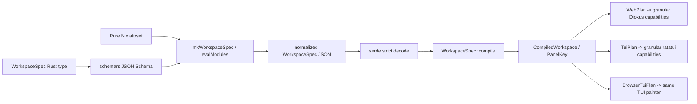

# Solution C-F — Spec Compiler with Capability-Assembled Shells and a Parity Matrix

## Decision summary

Adopt proposal F's three-part mechanism, but spend less abstraction than the original proposal:

1. **One authoritative `WorkspaceSpec`.** The source of truth is a Rust type in `panel-kit-core::spec`, derived with `serde` and `schemars`. Nix's `mkWorkspaceSpec` is a pure, typed authoring surface that emits that exact JSON contract. Nix is never needed at application runtime.
2. **Compile once, render through capabilities.** `WorkspaceSpec` compiles into an immutable, validated `CompiledWorkspace`. String panel IDs are interned once into copyable `PanelKey(u32)` values. The web and TUI crates expose panel frame, dock, input, drag, persistence, content, and theme capabilities separately; there is no replacement god object and no `render(body)` entry point.
3. **Make parity falsifiable.** A native Rust `spec-parity` tool decodes every repository Nix spec, compares the schema-derived field set with each backend's actual lowered plan, and reports the `(spec, backend, field)` cell that is missing or different. Separate canary builds prove the web path remains wasm32, the TUI path remains native, and browser-TUI remains wasm32.

`WorkspaceSpec` **lives in `panel-kit-core` and is not Rust-build-time-only**: a plain Rust application may construct or deserialize it without Nix. It is immutable after compilation. The **Nix producer is build-time only**; Nix evaluation writes JSON that Rust embeds or validates during a build. No application invokes Nix, links libnix, or reads the Nix store at runtime.

This is a clean-cutover design. It does not retain `Workspace`, `TuiWorkspace`, `use_workspace`, `Workspace::render`, `TuiWorkspace::render`, or `mkLayout` as compatibility aliases.

## 1. Problem statement and verified evidence

### 1.1 The core already owns shared semantics, but the shells still own control flow

The working tree already has the renderer-neutral pieces that earlier proposals incorrectly treated as future work:

- `SurfaceProfile`, `SurfaceCapabilities`, tier thresholds, and `effective_mode` are in core (`crates/panel-kit-core/src/lib.rs:69-165`).
- The keyboard command vocabulary and mapping are in core (`crates/panel-kit-core/src/lib.rs:201-332`), and `apply_command` is already present at `crates/panel-kit-core/src/lib.rs:870-971`.
- `SavedLayoutV2`, `StoredLayout`, `migrate_v1`, `reconcile_units`, and `merge_defaults` already exist (`crates/panel-kit-core/src/lib.rs:977-1077`).
- `mkLayout` already emits V2, including `version`, `units`, `viewport`, `mode`, and panel geometry (`nix/lib/mkLayout.nix:106-135`). These are existing facts, not deliverables of this design.

The remaining inversion of control is concrete. The web `Workspace<K>` owns eight public signals and a private focus signal (`src/lib.rs:293-323`), while `use_workspace` constructs them, installs resize hooks, and persists them (`src/lib.rs:344-470`). `Workspace::render` chooses visibility, geometry, chrome, event handlers, panel body placement, and resize grips in one method (`src/lib.rs:766-930`); `Workspace::dock` separately owns minimized-panel rendering and restoration (`src/lib.rs:1024-1069`). A host cannot use one panel frame, replace just the dock, or omit persistence without adopting that controller.

The TUI repeats the pattern. `TuiWorkspace<K>` owns panels, mode, focus, drag, storage, surface, hit zones, charset, and scroll (`crates/panel-kit-tui/src/lib.rs:186-222`). Its `render` method draws root chrome, lays out all panels, paints lights, invokes bodies, records hit zones, draws the dock, and draws the workspace scrollbar (`crates/panel-kit-tui/src/lib.rs:335-660`). This violates the repository rule that renderer-neutral state and shared transitions belong in core while backend crates translate and draw (`AGENTS.md:3-23`).

### 1.2 Persistence is duplicated and the shared abstraction is misplaced

Web persistence is two private functions hardwired to `gloo_storage::LocalStorage`: `save_layout` constructs V2 (`src/lib.rs:249-265`) and `load_layout` parses V1/V2, reconciles units, and merges defaults (`src/lib.rs:269-283`). TUI defines the public `LayoutStore` trait inside the backend crate (`crates/panel-kit-tui/src/lib.rs:144-155`) and repeats the parse/reconcile/merge pipeline in construction and `restore_pending_layout` (`crates/panel-kit-tui/src/lib.rs:246-274,315-328`). `LayoutStore` is therefore already real, but it is in the wrong crate and only one renderer can name it.

### 1.3 The theme and widget surfaces are asymmetric

The same dark palette currently has two executable definitions: CSS variables in `assets/panel-kit.css:5-28` and `Theme::DARK` in `crates/panel-kit-tui/src/theme.rs:38-53`. `Theme::PAPER` is a third preset definition at `crates/panel-kit-tui/src/theme.rs:57-72`. The sets do not even have identical expressive power: CSS includes inverse colors, focus ring, hit target, header height, tile metrics, and font, while the TUI `Theme` contains only its color subset.

Renderer-neutral badge behavior is already sensibly in core, but its render inputs remain asymmetric. Web `Badge` accepts `active`, `with_x`, `with_plus`, `small`, `override_color`, `accent_color`, `click_kind`, and `emit_hover` (`src/badge.rs`, `Badge` component), whereas TUI `Badge` stores only kind, field, value, active, and override color (`crates/panel-kit-tui/src/badge.rs`, `Badge`). Charts, table, meter, scroll, and status are TUI-only modules (`crates/panel-kit-tui/src/lib.rs:35-42`). Their data shapes are currently mixed into the renderer: for example `Series`, `GaugeItem`, `FlameSpan`, and `BoxItem` live in `crates/panel-kit-tui/src/charts.rs:30-35,105-113,171-181,311-319`.

### 1.4 The Nix surface is layout-only and its green check conceals live drift

`mkLayout` covers only the persisted layout shape (`nix/lib/mkLayout.nix:1-28,106-135`). It cannot express panel metadata, surface policy, chrome, command bindings, theme, charset, persistence policy, badges, widgets, or symbolic content bindings.

The current check does not compare Nix with Rust. `checks.layout-canary-schema` uses `jq`, asserts seven panels, and checks JSON key shapes (`flake.nix:118-149`). The Nix canary actually contains seven panels (`nix/examples/workspace-canary.nix:24-32`), but the Rust canary enum and defaults now contain nine, including `Flame` and `Distribution` (`crates/panel-kit-tui/examples/workspace_canary.rs:8-50`). This is the required live counterexample: shape-only parity is green while semantic parity is false.

### 1.5 Existing build constraints are strict but sufficient

The flake already provides a Rust toolchain with `wasm32-unknown-unknown`, crane, Dioxus 0.6, trunk, wasm-bindgen-cli, and lld (`flake.nix:32-66,166-178`). The current wasm crane source includes `Cargo.toml`, `Cargo.lock`, `src`, `crates`, `assets`, and examples (`flake.nix:46-56`). Hydra builds only `x86_64-linux` and `aarch64-darwin` (`flake.nix:19-30`) and aggregates every per-system check through `builtins.attrValues` (`flake.nix:190-212`). Therefore a small native Rust checker plus three deduplicated backend builds fits the existing model; no new evaluator, language, browser service, or code generator is necessary.

## 2. Judge concerns and the design changes that answer them

| Concern | Specific answer |
| --- | --- |
| Proposal was based on stale HEAD | This design treats `SurfaceProfile`/`effective_mode`, the command layer, V2 persistence and migration, V2 `mkLayout`, and TUI `LayoutStore` as existing. The design promotes or composes them; it does not re-propose them. |
| Shape-only parity missed the 7-vs-9 drift | `spec-parity` compares normalized panel identity/order/count and every schema leaf from Nix with the Rust/backend plans. The current Nix canary fails at `/panels/length`, `/panels/2/id` and subsequent IDs before any migration is applied. A permanent negative core test retains the seven-versus-nine mismatch as a regression case. |
| C-F looked infeasible in crane/Hydra | The spec type stays in core. A two-file internal Rust checker crate runs natively; `schemars` and `serde_json` are native-check-only dependencies. Matrix cells execute inside one derivation, so `N specs × 3 backends` does not create `3N` cargo rebuilds. Three existing-style canary builds cover web-wasm, TUI-native, and browser-TUI-wasm. Hydra's current aggregate discovers them automatically. |
| C-F layered a compiler on top of duplicated shells | The compiler replaces `mkLayout`, the hand-mirrored canary defaults, both controller types, both monolithic render methods, both backend load/parse/merge implementations, and the TUI-only theme definition. Section 6 inventories exact current declarations to remove. |
| Source of truth was ambiguous | Rust `WorkspaceSpec` is authoritative. `schemars` derives JSON Schema from it. The committed schema is check output, not a hand-edited contract. Nix module enum/bound helpers read that schema, and all Nix output must deserialize with `deny_unknown_fields`. A schema diff or decode error fails `spec-parity`. |
| A new god object could replace `Workspace` | There is no public shell controller. State, drag, surface, persistence, theme, input, content, frame, and dock are separate values/functions. Section 4.3 includes a single-panel composition with no workspace loop, dock, storage, surface observer, or default shell. |
| Widget/theme asymmetry | Renderer-neutral theme tokens and widget view models move to core. Both renderers implement the same built-in content kinds. Backend-only drawing types remain at the boundary. Arbitrary application content stays a named binding and is not dragged into core. |
| Runtime Nix dependency | Nix only produces JSON during flake evaluation/build. Rust may also construct the same type directly. Embedded JSON is parsed by Rust; no runtime Nix process or store lookup exists. |
| Spec versioning was speculative machinery | Version 1 is explicit and unsupported versions are rejected, but there is no migration trait or version lattice. `SavedLayoutV2` remains the separate, already-existing persisted-user-state migration contract. A WorkspaceSpec migration is introduced only when a second authored-spec version exists. |

## 3. Target architecture

### 3.1 Crate and module layout

```text
crates/panel-kit-core/src/
  lib.rs                 re-exports; existing geometry/input/persistence names
  spec.rs                authoritative WorkspaceSpec, validation, compile
  compiled.rs            PanelKey, CompiledWorkspace, capability requirements
  theme.rs               ThemeTokens and DARK/PAPER constants
  widgets.rs             renderer-neutral badge/chart/table/meter/status models
  persistence.rs         LayoutStore + shared V1/V2 load/save/clear operations

src/
  lib.rs                 web re-exports; no Workspace or use_workspace
  plan.rs                pure native/wasm WebPlan lowering for spec-parity
  panel.rs               PanelFrame and optional header/resize capabilities
  dock.rs                Dock capability
  input.rs               Dioxus event translation into existing core commands
  persistence.rs         LocalStorageStore + opt-in persistence hook
  theme.rs               ThemeTokens -> CSS custom-property string
  content.rs             built-in widget renderers + custom binding dispatch

crates/panel-kit-tui/src/
  lib.rs                 re-exports; no TuiWorkspace
  plan.rs                pure TuiPlan lowering used by renderer and parity tool
  panel.rs               draw_panel_frame and hit zones
  dock.rs                draw_dock
  input.rs               terminal events -> existing core transitions
  persistence.rs         FileLayoutStore
  content.rs             built-in widget drawing + custom binding dispatch
  charts.rs/table.rs/... drawing only; data types imported from core

nix/lib/
  workspace-spec-module.nix
  mkWorkspaceSpec.nix
nix/schema/
  workspace-spec.schema.json   generated evidence, never hand-edited
nix/specs/
  web-workspace.nix
  workspace-canary.nix
tools/spec-parity/
  Cargo.toml
  src/main.rs
```

`tools/spec-parity` is an unpublished workspace member. It is the only new crate. The original proposal's publishable `panel-kit-spec` crate is deliberately not created: the contract belongs in core under the repository architecture rule.

### 3.2 Authoritative Rust contract

All serialized structs use `#[serde(deny_unknown_fields)]`; all enums use explicit tagged representations and stable `snake_case` names. Every normalized output field is present, even when disabled, so omission is not silently interpreted as a default. Nullable fields use `#[serde(deserialize_with = "required_option")]` (or an explicit tagged `none`/`value` enum) so serde does not treat an absent `Option<T>` as equivalent to an emitted `null`.
Existing core contract types used inside the spec (`Units`, `Mode`, `WinState`, `Clamp`, `TileMetrics`, `ChromeMetrics`, `CommandStep`, `Key`, `KeyChord`, and `PanelCommand`) gain only the serialization/schema/debug derives they lack; their current transition logic and variants are reused unchanged. `BadgeKind` uses a tagged `{ "kind": "tag" }`, `{ "kind": "entity", "ty": ... }`, `{ "kind": "wikilink", ... }`, or `{ "kind": "url", ... }` representation. `SurfacePolicy` is new configuration around the existing `SurfaceProfile::from_logical_width`/`effective_mode` behavior, not a second surface classifier.
For readability the signatures below spell the derive as `JsonSchema`; implementation uses `#[cfg_attr(feature = "spec-schema", derive(JsonSchema))]`, so `schemars` is an optional native-check dependency and does not enter normal core or wasm builds.


```rust
pub const WORKSPACE_SPEC_VERSION: u32 = 1;

#[derive(Clone, Debug, PartialEq, Serialize, Deserialize, JsonSchema)]
#[serde(deny_unknown_fields)]
pub struct WorkspaceSpec {
    pub spec_version: u32,
    pub id: String,
    pub layout: LayoutSpec,
    pub surface: SurfacePolicy,
    pub chrome: ChromeSpec,
    pub input: InputSpec,
    pub theme: ThemeTokens,
    pub persistence: PersistencePolicy,
    pub panels: Vec<PanelSpec>,
}

#[derive(Clone, Debug, PartialEq, Serialize, Deserialize, JsonSchema)]
#[serde(deny_unknown_fields)]
pub struct LayoutSpec {
    pub units: Units,
    pub viewport: [f64; 2],
    pub preferred_mode: Mode,
    pub clamp: Clamp,
    pub tile: TilePolicy,
}

#[derive(Clone, Copy, Debug, PartialEq, Serialize, Deserialize, JsonSchema)]
#[serde(deny_unknown_fields)]
pub struct TilePolicy {
    pub resize: TileMetrics,
    pub min_render_row: f64,
}

#[derive(Clone, Debug, PartialEq, Serialize, Deserialize, JsonSchema)]
#[serde(deny_unknown_fields)]
pub struct PanelSpec {
    pub id: String,
    pub title: String,
    pub slug: String,
    pub default: PanelGeometry,
    pub content: ContentSpec,
}

#[derive(Clone, Copy, Debug, PartialEq, Serialize, Deserialize, JsonSchema)]
#[serde(deny_unknown_fields)]
pub struct PanelGeometry {
    pub x: f64,
    pub y: f64,
    pub w: f64,
    pub h: f64,
    pub state: WinState,
    pub z: i32,
    pub tile_w: u8,
    pub tile_h: u8,
}

#[derive(Clone, Copy, Debug, PartialEq, Serialize, Deserialize, JsonSchema)]
#[serde(deny_unknown_fields)]
pub struct SurfacePolicy {
    pub compact_max: f64,
    pub tablet_max: f64,
    pub compact: SurfaceClassPolicy,
    pub tablet: SurfaceClassPolicy,
    pub regular: SurfaceClassPolicy,
}

#[derive(Clone, Copy, Debug, PartialEq, Serialize, Deserialize, JsonSchema)]
#[serde(deny_unknown_fields)]
pub struct SurfaceClassPolicy {
    pub allows_floating: bool,
    pub window_management: bool,
    pub tile_columns: u8,
}

#[derive(Clone, Debug, PartialEq, Serialize, Deserialize, JsonSchema)]
#[serde(deny_unknown_fields)]
pub struct ChromeSpec {
    pub metrics: ChromeMetrics,
    pub hit_target_min: f64,
    pub panel_header_h: f64,
    pub panel_frame: bool,
    pub mode_control: bool,
    pub minimize_control: bool,
    pub maximize_control: bool,
    pub resize_grip: bool,
    pub dock: bool,
    pub charset: Charset,
}

#[derive(Clone, Debug, PartialEq, Serialize, Deserialize, JsonSchema)]
#[serde(deny_unknown_fields)]
pub struct InputSpec {
    pub steps: CommandStep,
    pub bindings: Vec<CommandBinding>,
}

#[derive(Clone, Debug, PartialEq, Serialize, Deserialize, JsonSchema)]
#[serde(deny_unknown_fields)]
pub struct CommandBinding {
    pub chord: KeyChord,
    pub command: PanelCommand,
}

#[derive(Clone, Debug, PartialEq, Serialize, Deserialize, JsonSchema)]
#[serde(tag = "kind", rename_all = "snake_case")]
pub enum PersistencePolicy {
    Disabled,
    Layout {
        store_binding: String,
        restore: bool,
        save: SaveTrigger,
    },
}

#[derive(Clone, Copy, Debug, PartialEq, Serialize, Deserialize, JsonSchema)]
#[serde(rename_all = "snake_case")]
pub enum SaveTrigger { Manual, StableChange }

#[derive(Clone, Copy, Debug, PartialEq, Eq, Serialize, Deserialize, JsonSchema)]
#[serde(rename_all = "snake_case")]
pub enum Charset { Unicode, Ascii }

#[derive(Clone, Copy, Debug, PartialEq, Eq, Serialize, Deserialize, JsonSchema)]
#[serde(deny_unknown_fields)]
pub struct ThemeTokens {
    pub bg: Rgb,
    pub panel: Rgb,
    pub fg: Rgb,
    pub dim: Rgb,
    pub line: Rgb,
    pub line2: Rgb,
    pub inverse_bg: Rgb,
    pub inverse_fg: Rgb,
    pub accent: Rgb,
    pub red: Rgb,
    pub yellow: Rgb,
    pub green: Rgb,
    pub blue: Rgb,
    pub pink: Rgb,
    pub badge_info: Rgb,
    pub focus_ring: Rgb,
}
```

`ThemeTokens` contains portable semantics only: `bg`, `panel`, `fg`, `dim`, `line`, `line2`, `inverse_bg`, `inverse_fg`, `accent`, `red`, `yellow`, `green`, `blue`, `pink`, `badge_info`, and `focus_ring`, all as the existing renderer-neutral `Rgb`. Hit target, header height, tiling columns, tile row size, and font selection are not falsely called colors: geometry lives in `ChromeSpec`/`LayoutSpec`, and web font choice remains backend/application CSS.

Content is a tagged renderer-neutral vocabulary. Dynamic values are named sources; executable Rust closures are never serialized.

```rust
#[derive(Clone, Debug, PartialEq, Serialize, Deserialize, JsonSchema)]
#[serde(tag = "kind", rename_all = "snake_case")]
pub enum ContentSpec {
    Custom { binding: String },
    Text { source: DataSource<TextModel>, scroll: ScrollPolicy },
    Editor { binding: String, multiline: bool, placeholder: String },
    Badges { source: DataSource<Vec<BadgeModel>> },
    Table { source: DataSource<TableModel> },
    TimeSeries { source: DataSource<Vec<SeriesModel>>, unit: String },
    Gauges { source: DataSource<Vec<GaugeModel>> },
    Flamegraph { source: DataSource<Vec<FlameSpanModel>> },
    Boxplot { source: DataSource<Vec<BoxItemModel>> },
    Meter { source: DataSource<MeterModel> },
    Status { source: DataSource<StatusModel> },
    Spinner { label: DataSource<String> },
}

#[derive(Clone, Debug, PartialEq, Serialize, Deserialize, JsonSchema)]
#[serde(tag = "source", rename_all = "snake_case")]
pub enum DataSource<T> {
    Inline { value: T },
    Binding { id: String },
}

pub struct BadgeModel {
    pub badge_kind: BadgeKind,
    pub field: String,
    pub value: String,
    pub active: bool,
    pub with_x: bool,
    pub with_plus: bool,
    pub small: bool,
    pub override_color: Option<Rgb>,
    pub accent_color: Option<Rgb>,
    pub click_kind: BadgeClickKind,
    pub emit_hover: bool,
}

// Every model below derives Clone, Debug, PartialEq, Serialize, Deserialize,
// and JsonSchema, with required nullable color fields.
pub struct TextModel { pub text: String }
pub enum ScrollPolicy { Clip, Wrap, Auto }
pub struct SeriesModel { pub name: String, pub points: Vec<[f64; 2]> }
pub struct GaugeModel { pub label: String, pub ratio: f64, pub text: String }
pub struct FlameSpanModel { pub label: String, pub depth: u16, pub value: f64, pub color: Option<Rgb> }
pub struct BoxItemModel { pub label: String, pub samples: Vec<f64>, pub color: Option<Rgb> }
pub struct MeterModel { pub label: String, pub ratio: f64, pub text: String, pub color: Option<Rgb> }
pub struct StatusModel { pub label: String, pub state: StatusState, pub color: Option<Rgb> }
pub enum StatusState { Idle, Active, Success, Warning, Error }
pub struct TableModel { pub columns: Vec<TableColumn>, pub rows: Vec<Vec<CellModel>> }
pub struct TableColumn { pub key: String, pub title: String, pub width: ColumnWidth, pub align: Align }
pub enum ColumnWidth { Auto, Fixed { cells: u16 }, Ratio { numerator: u16, denominator: u16 } }
pub enum Align { Left, Center, Right }
pub enum CellModel {
    Text { text: String },
    Status(StatusModel),
    Meter(MeterModel),
}
pub enum ContentKind {
    Text, Editor, Badges, Table, TimeSeries, Gauges,
    Flamegraph, Boxplot, Meter, Status, Spinner,
}
pub enum ContentValue<'a> {
    Text(&'a TextModel),
    Editor(&'a str),
    Badges(&'a [BadgeModel]),
    Table(&'a TableModel),
    TimeSeries(&'a [SeriesModel]),
    Gauges(&'a [GaugeModel]),
    Flamegraph(&'a [FlameSpanModel]),
    Boxplot(&'a [BoxItemModel]),
    Meter(&'a MeterModel),
    Status(&'a StatusModel),
    Spinner(&'a str),
}
pub enum ContentAction {
    Edit(String),
    Badge(BadgeAction),
}
pub trait ContentModel {
    fn resolve<'a>(
        &'a self,
        binding: &str,
        expected: ContentKind,
    ) -> Result<ContentValue<'a>, BindingError>;
    fn apply(&mut self, binding: &str, action: ContentAction) -> Result<(), BindingError>;
}
```

The models preserve the current TUI shapes: series name/points, gauge label/ratio/text, flame label/depth/value/color, and box label/samples/color are verified at `crates/panel-kit-tui/src/charts.rs:30-35,105-113,171-181,311-319`. `accent_color` becomes `Option<Rgb>` rather than web-only arbitrary CSS, matching the renderer-neutral RGB boundary already established for TUI chart overrides in the current migration guide (`MIGRATION.md:314-352`).
`ContentModel` is itself optional: inline `DataSource` values need no provider, and `Custom` bindings are resolved by a renderer-specific host callback because their result is necessarily `Element` or ratatui drawing code. Backends must still advertise and validate the custom-binding capability, but core never owns the renderer value.

Compile and validation signatures:

```rust
pub trait PanelIdentity:
    Copy + Eq + Hash + Serialize + DeserializeOwned + 'static
{}
impl<T> PanelIdentity for T
where T: Copy + Eq + Hash + Serialize + DeserializeOwned + 'static {}

// Retained source-compatible convenience for Rust enum users.
pub trait PanelKind: PanelIdentity {
    fn title(self) -> &'static str;
}

pub trait PanelCatalog<K: PanelIdentity> {
    fn title(&self, key: K) -> Cow<'_, str>;
    fn slug(&self, key: K) -> Cow<'_, str>;
}

#[derive(Clone, Copy, Debug, PartialEq, Eq, Hash, Serialize, Deserialize)]
pub struct PanelKey(u32);
pub struct LayoutState<K> {
    pub panels: Vec<PanelWin<K>>,
    pub preferred_mode: Mode,
    pub focused: Option<K>,
    pub workspace_scroll: f64,
}


pub struct StaticCatalog<K: PanelKind>(PhantomData<K>);
impl<K: PanelKind> StaticCatalog<K> {
    pub const fn new() -> Self;
}
impl<K: PanelKind> PanelCatalog<K> for StaticCatalog<K> {
    fn title(&self, key: K) -> Cow<'_, str>;
    fn slug(&self, key: K) -> Cow<'_, str>;
}
#[derive(Clone)]
pub struct CatalogHandle<K: PanelIdentity>(Arc<dyn PanelCatalog<K>>);
impl<K: PanelIdentity> PartialEq for CatalogHandle<K> {
    fn eq(&self, other: &Self) -> bool;
}
impl<K: PanelKind> CatalogHandle<K> {
    pub fn static_kind() -> Self;
}
impl CatalogHandle<PanelKey> {
    pub fn compiled(spec: Arc<CompiledWorkspace>) -> Self;
}
pub struct CompiledWorkspace {
    panels: Box<[CompiledPanel]>,
    // immutable policies/tokens; string IDs are interned once
}

impl WorkspaceSpec {
    pub fn validate(&self) -> Result<(), Vec<SpecError>>;
    pub fn compile(&self) -> Result<CompiledWorkspace, Vec<SpecError>>;
    #[cfg(feature = "spec-json")]
    pub fn from_json(json: &str) -> Result<Self, SpecDecodeError>;
}

impl PanelCatalog<PanelKey> for CompiledWorkspace {
    fn title(&self, key: PanelKey) -> Cow<'_, str>;
    fn slug(&self, key: PanelKey) -> Cow<'_, str>;
}

impl CompiledWorkspace {
    pub fn panels(&self) -> &[CompiledPanel];
    pub fn panel(&self, key: PanelKey) -> &CompiledPanel;
    pub fn key(&self, id: &str) -> Option<PanelKey>;
    pub fn required_capabilities(&self) -> CapabilitySet;
    pub fn canonical_manifest(&self) -> SemanticManifest;
    pub fn encode_layout(&self, state: &LayoutState<PanelKey>) -> SavedLayoutV2<String>;
    pub fn decode_layout(
        &self,
        stored: StoredLayout<String>,
        units: Units,
        viewport: (f64, f64),
    ) -> Result<LayoutState<PanelKey>, LayoutError>;
}
```

Compilation is an initialization cost, not a render-loop cost. `PanelKey` is copyable; render and reducer paths do not allocate or repeatedly hash strings. Core transitions that do not need a title narrow their bound from `PanelKind` to `PanelIdentity`; render capabilities take a `PanelCatalog<K>`. `StaticCatalog<K>` adapts existing Rust enums through `PanelKind::title`, while `CompiledWorkspace` supplies dynamic titles/slugs for `PanelKey`. Spec-path persistence encodes stable string IDs and resolves them back through the catalog, so reordering the spec cannot corrupt a saved layout by persisting transient numeric keys. A backend frame borrows `CompiledWorkspace`, tokens, and content models.

Validation reports all errors with JSON-pointer paths in one pass. It rejects unsupported `spec_version`; empty or duplicate workspace/panel/binding IDs; duplicate slugs; non-finite or non-positive viewport/panel sizes; more than one initially maximized panel; spans outside the existing `1..=4` and `1..=6` bounds; unordered/non-positive surface thresholds; impossible tile-column policies; duplicate key chords; invalid gauge ratios; negative/non-finite flame weights; non-finite series/samples; and missing runtime content/store bindings. Binding availability is checked when a `ContentRegistry`/store registry is attached, before the first frame.

### 3.3 Capabilities instead of a monolithic shell

Core promotes `LayoutStore` and centralizes the already-existing V1/V2 behavior:

```rust
pub trait LayoutStore {
    fn load(&self) -> Result<Option<String>, String>;
    fn save(&self, json: &str) -> Result<(), String>;
    fn clear(&self) -> Result<(), String>;
}

pub fn restore_layout<K: PanelKind>(
    store: &dyn LayoutStore,
    defaults: &[PanelWin<K>],
    units: Units,
    viewport: (f64, f64),
) -> Result<Option<SavedLayoutV2<K>>, LayoutError>;

pub fn persist_layout<K: PanelKind>(
    store: &dyn LayoutStore,
    state: &LayoutState<K>,
    units: Units,
    viewport: (f64, f64),
) -> Result<(), LayoutError>;
```

`restore_layout` calls the existing `StoredLayout`/`migrate_v1`/`reconcile_units`/`merge_defaults` sequence; backends only supply transport. `LocalStorageStore` remains web-only and `FileLayoutStore` remains TUI-only.

The web surface is deliberately granular:

```rust
pub struct PanelSignals<K> {
    pub panels: Signal<Vec<PanelWin<K>>>,
    pub preferred_mode: Signal<Mode>,
    pub focused: Signal<Option<K>>,
    pub workspace_scroll: Signal<f64>,
}

pub struct DragController<K> {
    pub drag: Signal<Option<Drag>>,
    pub tile_drag: Signal<Option<K>>,
}
pub struct SurfaceController {
    pub viewport: Signal<(f64, f64)>,
    pub profile: Signal<SurfaceProfile>,
}

pub fn use_panel_signals<K>(init: impl FnOnce() -> LayoutState<K>) -> PanelSignals<K>;
pub fn use_drag_controller<K>() -> DragController<K>;
pub fn use_surface(policy: SurfacePolicy) -> SurfaceController;
pub fn use_layout_persistence<K: PanelIdentity>(
    state: PanelSignals<K>,
    catalog: CatalogHandle<K>,
    store: impl LayoutStore + 'static,
    policy: PersistencePolicy,
    surface: SurfaceController,
);

#[component]
pub fn PanelFrame<K: PanelIdentity>(
    state: PanelSignals<K>,
    catalog: CatalogHandle<K>,
    panel_index: usize,
    drag: Option<DragController<K>>,
    surface: SurfaceProfile,
    chrome: ChromeSpec,
    theme: ThemeTokens,
    body: Element,
    header_actions: Option<Element>,
) -> Element;

#[component]
pub fn Dock<K: PanelIdentity>(
    state: PanelSignals<K>,
    catalog: CatalogHandle<K>,
    theme: ThemeTokens,
) -> Element;

pub fn handle_pointer_move<K: PanelIdentity>(
    state: PanelSignals<K>,
    drag: DragController<K>,
    surface: SurfaceController,
    event: &DioxusPointerEvent,
    clamp: Clamp,
    tile: TileMetrics,
);
pub fn handle_pointer_up<K: PanelIdentity>(
    state: PanelSignals<K>,
    drag: DragController<K>,
    event: &DioxusPointerEvent,
) -> InputOutcome;
pub fn handle_key<K: PanelIdentity>(
    state: PanelSignals<K>,
    surface: SurfaceController,
    input: &InputSpec,
    event: &KeyboardEvent,
) -> InputOutcome;
```

`PanelSignals` is state storage, not a controller: it has no render, persistence, observer, input, or chrome methods. A host may use its own Dioxus signals and call the same free adapter functions through documented `ReadPanelState`/`WritePanelState` traits. `DragController`, `SurfaceController`, and persistence are independently omitted or replaced.

The TUI exposes the same seams in immediate-mode form:

```rust
pub fn plan_workspace<K: PanelIdentity>(
    state: &LayoutState<K>,
    catalog: &impl PanelCatalog<K>,
    area: Rect,
    surface: &SurfacePolicy,
    chrome: &ChromeSpec,
) -> TuiPlan<K>;
pub fn draw_root<K>(frame: &mut Frame, plan: &TuiPlan<K>, theme: &ThemeTokens, charset: Charset);
pub fn draw_panel_frame<K: PanelIdentity>(
    frame: &mut Frame,
    panel: &PlannedPanel<K>,
    catalog: &impl PanelCatalog<K>,
    theme: &ThemeTokens,
    charset: Charset,
    body: impl FnOnce(&mut Frame, Rect, K, bool),
);
pub fn draw_dock<K: PanelIdentity>(
    frame: &mut Frame,
    dock: &PlannedDock<K>,
    catalog: &impl PanelCatalog<K>,
    theme: &ThemeTokens,
);
pub fn draw_workspace_scrollbar<K>(
    frame: &mut Frame,
    plan: &TuiPlan<K>,
    theme: &ThemeTokens,
);
pub fn hit_test<K: PanelIdentity>(plan: &TuiPlan<K>, event: PointerEvent) -> Option<TuiHit<K>>;
pub fn apply_key<K: PanelIdentity>(
    state: &mut LayoutState<K>,
    chord: KeyChord,
    focus: FocusContext<K>,
    input: &InputSpec,
    clamp: Clamp,
    viewport: (f64, f64),
) -> InputOutcome;
pub fn apply_pointer<K: PanelIdentity>(
    state: &mut LayoutState<K>,
    drag: &mut Option<Drag>,
    hit: TuiHit<K>,
    event: PointerEvent,
    clamp: Clamp,
    tile: TileMetrics,
) -> InputOutcome;
```

A complete shell exists only as executable example composition, not as a privileged public handle.

A genuine single-panel composition is therefore possible:

```rust
let state = use_panel_signals(|| LayoutState::new(vec![one_panel()]));
let body = rsx! { Inspector { selected } };
rsx! {
    PanelFrame {
        state,
        catalog: CatalogHandle::<Panel>::static_kind(),
        panel_index: 0,
        drag: None,
        surface: fixed_profile,
        chrome: ChromeSpec::frame_only(),
        theme: ThemeTokens::DARK,
        body,
        header_actions: None,
    }
}
```

This composition has no workspace root, dock, localStorage, resize observer, keyboard map, or all-panels loop. A TUI host can likewise call `draw_panel_frame` directly. These are the required escape hatches.

### 3.4 Backend plans and the parity contract

Each backend has a pure lowering path used by production rendering and by the native checker:

```rust
pub trait BackendPlan: ParityProjection {
    const BACKEND: BackendId;
    fn capabilities() -> CapabilitySet;
    fn lower(spec: &CompiledWorkspace) -> Result<Self, BackendError>
    where Self: Sized;
}

pub trait ParityProjection {
    fn semantic_manifest(&self) -> SemanticManifest;
}
```

`WebPlan` is compiled on native with `panel-kit --no-default-features --features spec-plan`; its module depends only on core. DOM/Dioxus modules remain behind the default `web` feature. `TuiPlan` is already host-buildable. `BrowserTuiPlan` uses the TUI planner with the browser platform descriptor and independently validates its charset/platform capabilities.

`SemanticManifest` is produced from the backend plan's private normalized fields, not by echoing input JSON. It records every schema leaf, normalized panel count/order/IDs, required content renderer and binding, persistence action, and backend applicability. Production painters accept these plan types rather than the raw spec; there is no second unplanned interpretation path.

“Every field is honored” has a testable definition:

1. The schema leaf exists in the Rust-derived schema.
2. Nix emits it and strict serde accepts it.
3. Core compilation validates and normalizes it.
4. Each backend plan projects the same semantic value, or fails with a named unsupported capability. There is no silent `not applicable`: portable `WorkspaceSpec` deliberately omits fields, such as a web font family, which a backend cannot implement.
5. A backend behavioral test observes the corresponding plan effect for each field group (geometry, chrome, input, theme, persistence, or content).

Adding a Rust field changes the derived schema. Until Nix emits it and every backend plan projects it, `spec-parity` fails. Removing or renaming a field makes strict Nix decode or schema comparison fail. Adding a content kind requires a new capability; every backend lacking it fails before rendering.

### 3.5 Nix-to-Rust-to-backend data flow



For a Nix consumer, the flake writes `spec.json` and sets `PANEL_KIT_WORKSPACE_SPEC` to its build-time store path. The Rust canary uses:

```rust
let spec = WorkspaceSpec::from_json(include_str!(env!("PANEL_KIT_WORKSPACE_SPEC")))?;
let compiled = spec.compile()?;
```

The store path is consumed by `rustc` at build time. The binary contains bytes and invokes no Nix API. A non-Nix consumer uses `WorkspaceSpec { ... }`, `serde_json::from_str(include_str!("workspace.json"))`, or ignores `WorkspaceSpec` and directly composes existing generic core geometry/input functions.

## 4. Pure-Nix specification surface

### 4.1 Public flake API and single-source rule

`lib.${system}` exports only:

```nix
{
  mkWorkspaceSpec = import ./nix/lib/mkWorkspaceSpec.nix { inherit lib workspaceSpecModule specSchema; };
  workspaceSpecModule = import ./nix/lib/workspace-spec-module.nix { inherit lib specSchema; };
  specSchema = builtins.fromJSON (builtins.readFile ./nix/schema/workspace-spec.schema.json);
}
```

`mkLayout`, `winStates`, `modes`, `unitKinds`, `schemaVersion`, `tileWMax`, and `tileHMax` are removed from the public flake surface. Enum values and numeric bounds used by the Nix module are read from `specSchema`; they are not independently restated in a `specTypes` attrset.

`workspace-spec.schema.json` is regenerated by `spec-parity schema` and compared byte-for-byte after canonical key ordering. Contributors edit Rust, never the JSON file. `spec-parity` also walks schema properties and Nix normalized output, so a manually stale Nix option tree cannot remain green merely because a checked fixture omitted an optional path.

### 4.2 Nix attrset schema

`mkWorkspaceSpec` calls `lib.evalModules`, returns `{ value; json; }`, and expands every default into `value`. The ergonomic module input uses camelCase option names; `value`/`json` normalize them to the Rust schema's snake_case field names. `spec_version = 1` is always emitted from the Rust-derived schema constant and is not caller-overridable. Its input is:

```nix
pk.lib.${system}.mkWorkspaceSpec {
  id = "workspace-canary";

  layout = {
    units = "cells";                 # css_px | cells
    viewport = [ 128.0 52.0 ];
    preferredMode = "floating";      # floating | tiling
    clamp = {
      outerW = 0.0; outerH = 0.0; floorW = 24.0; floorH = 8.0;
      inner = 2.0; edge = 0.0; minW = 20.0; minH = 5.0;
    };
    tile = {
      resize = { row = 4.0; colFloor = 12.0; outer = 0.0; };
      minRenderRow = 4.0;
    };
  };

  surface = {
    compactMax = 60.0;
    tabletMax = 110.0;
    compact = { allowsFloating = false; windowManagement = false; tileColumns = 1; };
    tablet = { allowsFloating = true; windowManagement = true; tileColumns = 2; };
    regular = { allowsFloating = true; windowManagement = true; tileColumns = 4; };
  };

  chrome = {
    metrics = { inset = 1.0; dockH = 3.0; };
    hitTargetMin = 1.0;
    panelHeaderH = 1.0;
    panelFrame = true;
    modeControl = true;
    minimizeControl = true;
    maximizeControl = true;
    resizeGrip = true;
    dock = true;
    charset = "unicode";             # unicode | ascii
  };

  input = {
    steps = { coarse = 2.0; fine = 1.0; };
    bindings = [
      { chord = { key = "left"; shift = false; alt = false; ctrl = false; meta = false; };
        command = { kind = "move"; dx = -16.0; dy = 0.0; }; }
      # normalized output contains the complete existing command_for table
    ];
  };

  theme = {
    bg = [ 10 10 10 ]; panel = [ 13 13 13 ]; fg = [ 237 237 237 ];
    dim = [ 122 122 122 ]; line = [ 38 38 38 ]; line2 = [ 95 95 95 ];
    inverseBg = [ 237 237 237 ]; inverseFg = [ 10 10 10 ];
    accent = [ 94 243 140 ]; red = [ 255 95 86 ]; yellow = [ 255 189 46 ];
    green = [ 39 201 63 ]; blue = [ 59 155 255 ]; pink = [ 255 95 195 ];
    badgeInfo = [ 131 183 204 ]; focusRing = [ 237 237 237 ];
  };

  persistence = {
    kind = "layout";                 # disabled | layout
    storeBinding = "canary.layout";
    restore = true;
    save = "stable_change";          # manual | stable_change
  };

  panels = [
    {
      id = "workspace";
      title = "Workspace";
      slug = "workspace";
      default = {
        x = 1.0; y = 0.0; w = 62.0; h = 11.0;
        state = "floating"; z = 1; tileW = 1; tileH = 2;
      };
      content = { kind = "custom"; binding = "canary.workspace"; };
    }
    {
      id = "badges";
      title = "Badges";
      slug = "badges";
      default = {
        x = 65.0; y = 0.0; w = 63.0; h = 11.0;
        state = "floating"; z = 5; tileW = 2; tileH = 3;
      };
      content = {
        kind = "badges";
        source = "inline";
        value = [
          {
            badgeKind = { kind = "tag"; }; field = "tag"; value = "browser-tui";
            active = false; withX = false; withPlus = false; small = false;
            overrideColor = [ 80 180 130 ]; accentColor = null;
            clickKind = "toggle"; emitHover = false;
          }
        ];
      };
    }
  ];
}
```

Together, `web-workspace.nix` and the real nine-panel `workspace-canary.nix` exercise every `ContentSpec` variant needed by the current examples. The abbreviated sample above demonstrates shape, not a reduced acceptance target.

Every content option has one of these complete normalized shapes:

| `content.kind` | Additional fields |
| --- | --- |
| `custom` | `binding: string` |
| `text` | `source: DataSource<{ text: string }>`; `scroll: "clip" | "wrap" | "auto"` |
| `editor` | `binding: string`; `multiline: bool`; `placeholder: string` |
| `badges` | `source: DataSource<[BadgeModel]>`; each badge has required `badgeKind`, `field`, `value`, `active`, `withX`, `withPlus`, `small`, nullable `overrideColor`, nullable `accentColor`, `clickKind`, and `emitHover` |
| `table` | `source: DataSource<{ columns = [{ key, title, width, align }]; rows = [[CellModel]]; }>`; `width` is tagged `auto`, `fixed { cells }`, or `ratio { numerator, denominator }`; `align` is `left`, `center`, or `right` |
| `time_series` | `source: DataSource<[{ name, points = [[x y]]; }]>`; `unit: string` |
| `gauges` | `source: DataSource<[{ label, ratio, text }]>` |
| `flamegraph` | `source: DataSource<[{ label, depth, value, color }]>`; `color` is an explicit RGB triple or `null` |
| `boxplot` | `source: DataSource<[{ label, samples, color }]>`; `color` is an explicit RGB triple or `null` |
| `meter` | `source: DataSource<{ label, ratio, text, color }>` |
| `status` | `source: DataSource<{ label, state, color }>`; `state` is `idle`, `active`, `success`, `warning`, or `error` |
| `spinner` | `label: DataSource<string>` |

For every `DataSource<T>`, inline data is `{ source = "inline"; value = T; }`; dynamic data is `{ source = "binding"; id = "stable.binding.id"; }`. `CellModel` is tagged `text { text }`, `status { label, state, color }`, or `meter { label, ratio, text, color }`, which is sufficient to express the canary's combined name/health/load/detail rows without leaking ratatui `Row` or `Constraint` into core.

### 4.3 Completeness against the two current examples

| Current expression | Verified evidence | `WorkspaceSpec` representation | Backend obligation |
| --- | --- | --- | --- |
| Five web panel identities and titles | `examples/workspace.rs:66-84` | `panels[].{id,title,slug}` | Both plans retain stable identity and label; spec compiler uses `PanelKey`. |
| Web floating rectangles, z order, minimized Help, and tile spans | `examples/workspace.rs:88-102` | `panels[].default.{x,y,w,h,z,state,tileW,tileH}` | Both plans produce equivalent normalized geometry; existing core geometry remains authoritative. |
| Nine TUI canary panels including Flame and Distribution | `crates/panel-kit-tui/examples/workspace_canary.rs:8-50` | Same panel list, with nine entries | All three matrix rows must report nine in identical order. |
| Preferred floating/tiling mode | Web observes it at `examples/workspace.rs:114-117`; current Nix layout sets it at `nix/examples/workspace-canary.nix:23` | `layout.preferredMode` | Resolve through existing `effective_mode`, never backend-local mode logic. |
| CSS-pixel versus cell geometry and capture viewport | Current V2 contract is `crates/panel-kit-core/src/lib.rs:996-1009`; Nix currently emits it at `nix/lib/mkLayout.nix:119-126` | `layout.{units,viewport}` | Use existing `reconcile_units` when applying defaults/saved state to a renderer. |
| Compact/tablet/regular behavior and input capabilities | Core policy exists at `crates/panel-kit-core/src/lib.rs:99-146`; web example displays it at `examples/workspace.rs:118-130` | `surface` thresholds/class policies; live pointer/hover/keyboard capabilities remain renderer observations | Backend combines specified width policy with observed input capabilities. |
| Chrome inset/dock height | Core `ChromeMetrics` and `workspace_chrome` are `crates/panel-kit-core/src/lib.rs:422-459`; TUI uses `ChromeMetrics::CELLS` at `crates/panel-kit-tui/src/lib.rs:368-374` | `chrome.metrics` | Both planners call core `workspace_chrome`; no private constants. |
| Panel controls, resize grip, dock | Web monolith emits them at `src/lib.rs:897-923,967-1004,1024-1069`; TUI monolith at `crates/panel-kit-tui/src/lib.rs:493-614,617-641` | `chrome.{panelFrame,modeControl,minimizeControl,maximizeControl,resizeGrip,dock}` | Each capability may be disabled; enabled fields appear in plan and behavior tests. |
| Unicode/ASCII glyph choice | TUI `Charset` is `crates/panel-kit-tui/src/lib.rs:84-110` and currently configured as a workspace builder option at `:276-282` | `chrome.charset` | Web and TUI both map semantic glyphs through the same charset choice. |
| Full dark/paper semantic color palette | CSS values at `assets/panel-kit.css:5-23`; TUI presets at `crates/panel-kit-tui/src/theme.rs:38-72` | `theme` RGB fields | Web emits CSS variables from tokens; TUI converts the same RGB values to ratatui colors. |
| Existing command table and coarse/fine step | `command_for` and `CommandStep` are `crates/panel-kit-core/src/lib.rs:251-332` | `input.steps` plus normalized `input.bindings` | Backend only translates events; core resolves bindings and applies commands. |
| Web Notes editor | `examples/workspace.rs:135-145` | `ContentSpec::Editor { binding = "web.notes", multiline = true, placeholder }` | Host supplies the value/update binding; spec controls the panel/content kind. |
| Web Preview, live Status, Help, and BelowFold bodies | `examples/workspace.rs:146-264` | `Custom` bindings for live/application-specific bodies or inline `Text` for static copy; `scroll` is explicit | Both backends can resolve a custom binding; the app still owns arbitrary domain UI. |
| Top bar, reset button, and tooltip overlay | `examples/workspace.rs:266-310` | **Not WorkspaceSpec fields**: these are host-owned app chrome/actions outside the panel surface. Reset calls `LayoutStore::clear`; tooltip continues to use `tip_pos`. | Capability design preserves host ownership rather than serializing arbitrary Dioxus trees. |
| Demo CSS affecting app body classes | `examples/workspace.rs:50-63` | **Not portable spec**; backend/application stylesheet. Panel `slug` preserves styling hook. | No false claim that terminal can honor arbitrary CSS. |
| Badge kinds, entity/link/URL payloads, active and override color | `crates/panel-kit-tui/examples/workspace_canary.rs:64-109`; web's additional flags are in `src/badge.rs` | `ContentSpec::Badges` + full `BadgeModel` | Both badge renderers accept the same model and emit the same core `BadgeAction`. |
| Node table rows `(name, healthy, load, detail)` | `crates/panel-kit-tui/examples/workspace_canary.rs:55-62` | Inline/bound `TableModel`; health/load cells use status/meter cell models | Web and TUI implement table/status/meter renderers. |
| Rolling series name/points | `crates/panel-kit-tui/examples/workspace_canary.rs:128-201` | `TimeSeries` with binding plus `SeriesModel` | `Metrics::tick` remains app data production; both backends draw its model. |
| Boxplot label/samples/color | `crates/panel-kit-tui/examples/workspace_canary.rs:204-214` | `Boxplot` + `BoxItemModel` binding | Quartile semantics move to core; drawing remains backend-specific. |
| Flame label/depth/value/color | `crates/panel-kit-tui/examples/workspace_canary.rs:219-256` | `Flamegraph` + `FlameSpanModel` binding | Both renderers consume the same tree semantics. |
| Capacity label/ratio/text | `crates/panel-kit-tui/examples/workspace_canary.rs:267-290` | Inline/bound `Gauges` + `GaugeModel` | Same thresholds and semantics, renderer-specific drawing. |
| Deterministic noise, rolling buffers, stage names | `crates/panel-kit-tui/examples/workspace_canary.rs:112-187` | **Binding implementation, not schema.** Spec names `canary.metrics`; Rust supplies live values. | Avoids leaking apple-notes-flavored data generation into core, directly answering the original F risk. |
| Layout transport and save policy | Web hardcodes localStorage in `src/lib.rs:249-283`; TUI transport is `crates/panel-kit-tui/src/lib.rs:144-171` | `persistence` selects disabled/layout, binding, restore, and save trigger | Host registry binds the symbolic name to LocalStorage, file, browser storage, or custom store. |

The distinction between declarative content **selection/configuration** and executable application **data production** is intentional. A pure Nix WorkspaceSpec can completely state which panel uses which widget or binding; it cannot and should not serialize a Dioxus closure, a database query, or the canary's animation loop.

## 5. Mechanized `spec-parity` proof

### 5.1 Checks and build topology

The flake adds these named checks:

- `checks.spec-parity`: one native derivation. It runs the Rust checker across every `nix/specs/*.nix` JSON and the three descriptors `web-wasm`, `tui-native`, and `browser-tui`. It also regenerates/canonicalizes the schemars schema and compares it with `nix/schema/workspace-spec.schema.json`.
- `checks.workspace-spec-web-wasm`: builds `examples/workspace_spec.rs` for `wasm32-unknown-unknown` using the compiled `web-workspace.nix` and feature-complete canary.
- `checks.workspace-spec-tui-native`: builds the native TUI workspace example from the same compiled specs.
- `checks.workspace-spec-browser-tui-wasm`: builds the Ratzilla example for wasm32 from the same compiled specs, replacing the current narrower `browser-tui-example` job rather than adding a duplicate.

`spec-parity` performs the logical `spec × backend` loop inside one process and emits a matrix report artifact. Cargo dependencies are built once per target and Nix store paths are shared; Hydra does not receive one crane derivation per cell. The existing `hydraJobs` definition already aggregates all check attr values (`flake.nix:190-212`), so no Hydra plugin or project change is required.

The native checker uses a separate crane argument set that omits `CARGO_BUILD_TARGET`; the web and browser-TUI checks keep the current wasm target. `schemars`, schema traversal, filesystem walking, and the parity CLI are behind `spec-schema`/`spec-plan` features and do not enter the default `panel-kit-core` dependency graph. `serde_json` is behind `spec-json`; spec-driven examples enable it, while generic core users do not. The default core remains serde plus renderer-neutral code, consistent with `crates/panel-kit-core/Cargo.toml:11-15`.

### 5.2 What each matrix cell proves

For each spec/backend pair the checker:

1. Strictly decodes Nix JSON to `WorkspaceSpec`.
2. Validates and compiles it.
3. Compares `required_capabilities()` with the backend descriptor.
4. Lowers through the same `WebPlan`/`TuiPlan` code production renderers consume.
5. Walks the schemars leaf set and requires a value at every path in the backend plan's `SemanticManifest`.
6. Compares normalized values, panel identity/order/count, content kinds/bindings, and persistence/input/theme/chrome decisions.
7. Writes a row containing status and a digest of the normalized plan.

Failure messages are actionable, for example:

```text
spec-parity: workspace-canary × web-wasm:
  /panels/2/id: nix="notes", rust="flame"
  /panels/length: nix=7, rust=9
```

or:

```text
spec-parity: web-workspace × tui-native:
  /panels/1/content/kind=time_series requires capability widget.time_series
  backend tui-native did not lower the field
```

A backend cannot silently skip a new field: the schema leaf set grows but its plan projection does not. A new content variant also grows `CapabilitySet`, so each backend must implement or explicitly fail; an explicit failure still makes the repository check red because repository specs require all three supported backends.

### 5.3 Catching and then deleting the live 7-vs-9 mirror

The first parity slice intentionally points the checker at the current files before migrating them. Rust's current canary manifest has nine entries (`workspace_canary.rs:8-50`); Nix has seven (`workspace-canary.nix:24-32`). The first failing test is `spec_parity_rejects_live_seven_vs_nine_canary`, and the initial `checks.spec-parity` run fails with the paths above.

The repair is not to update two permanent mirrors. `nix/specs/workspace-canary.nix` becomes the sole authored canary, with all nine panels. `workspace_canary.rs::defaults()` and its `Panel` enum/title table are deleted; TUI native and browser examples load the compiled spec and use `PanelKey` plus metadata. The permanent regression test feeds a seven-panel fixture and a nine-panel manifest to the comparator and asserts the exact mismatch class. Thus CI both demonstrates it could catch today's bug and removes the architecture that allowed it.

## 6. Deletion and net-simplification budget

This design is accepted only if the implementation deletes the listed incumbent paths; retaining them underneath new APIs would be layering and is out of scope.

### Files deleted or replaced

1. `nix/lib/mkLayout.nix` is deleted; `mkWorkspaceSpec.nix` replaces it and owns the layout subtree as part of the full contract.
2. `crates/panel-kit-tui/src/theme.rs` is deleted; core `ThemeTokens` is the one executable palette definition.
3. `nix/examples/workspace-canary.nix` moves to `nix/specs/workspace-canary.nix` and becomes authoritative, not a claimed mirror.

### Current declarations deleted

- Web: private `save_layout`, private `load_layout`, `Workspace<K>`, `use_workspace`, and the entire `Workspace` impl surface, including monolithic `render`, private `header`, and `dock` (`src/lib.rs:249-283,293-323,344-470,472-1070`). The current outline contains 19 `Workspace` methods plus its manual `Clone` implementation.
- TUI: `TuiWorkspace<K>` and its 15-method impl (`crates/panel-kit-tui/src/lib.rs:191-822`). `FileLayoutStore` survives as an adapter; the `LayoutStore` declaration is removed from this backend and promoted to core.
- Theme duplication: backend `Theme`, `Theme::DARK`, `Theme::PAPER`, and the concrete default color assignments in CSS. CSS retains structural rules and `var(...)` uses; web theme capability emits the variable values from core tokens.
- Canary duplication: `workspace_canary.rs::Panel`, its `PanelKind::title` match, and `defaults`; the Nix canary's stale comments/count assertion; and `checks.layout-canary-schema` with its hand-written jq key/count assertions.
- Widget-model placement: TUI declarations `Series`, `GaugeItem`, `FlameSpan`, `BoxItem`, and any table/status/meter semantic models are removed from renderer modules and re-exported from core. Drawing functions remain backend-owned.

The replacement capability functions are smaller and independently usable; they do not reproduce the two controller impls under new names. Shared persistence adds one parse/reconcile/merge path in core instead of two. The parity tool adds two source files, but eliminates a hand-maintained jq schema, hand-maintained canary mirror, and future per-backend field checklists.

## 7. Consumer migration — clean-cutover `MIGRATION.md` style

Git-pinned consumers remain on their current revision until their migration PR is green, matching the current pull-based policy (`PRODUCT.md:111-118`) and the existing notice format (`MIGRATION.md:435-454`). No deprecated aliases are shipped.

### 7.1 `jump-cannon`: replace controller props with explicit capabilities

Verified consumer evidence: the available checkout pins `panel-kit` in `app/ui/Cargo.toml:10-13`; it creates two workspaces at `app/ui/src/main.rs:916-917`, stores `Workspace<Panel>` in `ViewWs` and manually compares its signals at `app/ui/src/main.rs:1344-1358`, and uses a shell-owned render/header callback plus dock at `app/ui/src/main.rs:1360-1385`. It also has a global `OPEN_PANEL` bridge that calls `restore` (`app/ui/src/main.rs:889-939`).

**What changed:** `Workspace`, `use_workspace`, `render_with_header`/`render`, and method-based dock/input/restore are removed. The app owns two `PanelSignals<Panel>` values and opts into drag, surface, persistence, panel-frame, dock, and input capabilities.

**Why:** the application already owns view switching, camera keys, panel header actions, and body dispatch. It should also own their composition order rather than wrapping those decisions in a panel-kit controller.

Before (current consumer shape):

```rust
let ws_user = panel_kit::use_workspace(WORKSPACE_LAYOUT_KEY, default_layout);
let ws_sessions = panel_kit::use_workspace(SESSIONS_LAYOUT_KEY, sessions_default_layout);

{ws.render_with_header(
    move |kind, maximized| panel_body(kind, maximized, ctx),
    move |kind, maximized| panel_header_actions(kind, ctx),
)}
{ws.dock()}
```

After:

```rust
let user = panel_kit::use_panel_signals(|| LayoutState::from(default_layout()));
let user_catalog = CatalogHandle::<Panel>::static_kind();
let user_drag = panel_kit::use_drag_controller();
let user_surface = panel_kit::use_surface(SurfacePolicy::WEB);
panel_kit::use_layout_persistence(
    user,
    user_catalog.clone(),
    panel_kit::LocalStorageStore::new(WORKSPACE_LAYOUT_KEY),
    PersistencePolicy::stable("jump-cannon.user"),
    user_surface,
);

for index in visible_panel_indices(&user.panels.read()) {
    PanelFrame {
        state: user,
        catalog: user_catalog.clone(),
        panel_index: index,
        drag: Some(user_drag),
        surface: user_surface.profile(),
        chrome: ChromeSpec::WEB,
        theme: ThemeTokens::DARK,
        body: panel_body(user.panels.read()[index].kind, false, ctx),
        header_actions: panel_header_actions(user.panels.read()[index].kind, ctx),
    }
}
Dock { state: user, catalog: user_catalog, theme: ThemeTokens::DARK }
```

Migration details:

- Keep the existing `Panel` enum, `PanelKind` impl, `default_layout`, `sessions_default_layout`, and storage keys. This consumer does not have to adopt Nix or dynamic `PanelKey`.
- Replace `ViewWs(Workspace<Panel>)` with a local, derivable `ViewCapabilities { state, drag, surface }`; stop manually enumerating private shell signals in `PartialEq`.
- Replace `ws.restore(kind)` in the `OPEN_PANEL` drain with the existing core `restore(&mut state.panels.write(), kind)` and the existing raise command.
- Route panel-kit keyboard handling first and continue to jump-cannon's camera handler only on `InputOutcome::Unhandled`; palette precedence remains app-owned.
- Replace root pointer method calls with web input free functions receiving `state` and `drag`.
- Preserve the app-specific header-actions slot by passing `header_actions` to `PanelFrame`; keep the app's body match and GPU canvas ownership unchanged.
- Update the git revision only after its wasm app build and workspace browser canary pass.

### 7.2 `apple-notes-ocr-flow`: preserve reviewer content, split shell capabilities

The private consumer checkout is not present in the accessible working copy, so this design does not invent file names or line citations. The verified panel-kit repository states that the web shell was factored from its reviewer UI (`src/lib.rs:1-13`) and that it is a git-pinned consumer (`README.md:10-16`). Its migration is specified against the public panel-kit symbols, not guessed internal symbols.

**What changed:** replace each `use_workspace(storage_key, defaults)` call and `ws.render(body)`/`ws.dock()` composition with caller-owned signals and opt-in capabilities. Badge data uses the unified core `BadgeModel`, and arbitrary reviewer panes remain custom content bindings or direct Rust bodies.

**Why:** OCR stages, document navigation, editor state, and reviewer actions are application policy. Panel-kit supplies movable panel frames and reusable widgets without taking control of the reviewer tree.

Before:

```rust
let ws = panel_kit::use_workspace(REVIEW_LAYOUT_KEY, review_layout);
rsx! {
    {ws.render(|kind, maximized| reviewer_panel(kind, maximized))}
    {ws.dock()}
}
```

After:

```rust
let state = panel_kit::use_panel_signals(|| LayoutState::from(review_layout()));
let catalog = CatalogHandle::<Panel>::static_kind();
let drag = panel_kit::use_drag_controller();
let surface = panel_kit::use_surface(SurfacePolicy::WEB);
panel_kit::use_layout_persistence(
    state,
    catalog.clone(),
    panel_kit::LocalStorageStore::new(REVIEW_LAYOUT_KEY),
    PersistencePolicy::stable("apple-notes.review"),
    surface,
);

// The reviewer owns iteration and body dispatch; PanelFrame and Dock are opt-in.
```

Migration details:

- Keep its current enum/default layout first; Nix adoption is a separate optional edit. This proves the crate remains a plain Rust library.
- Preserve the localStorage key so existing V1/V2 records continue through core `restore_layout` and are not reset.
- Convert badge props to `BadgeModel`; replace any string CSS `accent_color` with an RGB semantic token or keep truly application-specific styling outside the portable model.
- Supply live OCR chart/status/table values through named binding providers. Stage names and colors remain application data; they do not enter core.
- Render reviewer-specific header actions and document/editor bodies directly inside `PanelFrame`.
- Update the pinned revision only after its wasm reviewer build and panel canary pass.

### 7.3 Breaking-change list for the release note

- `panel_kit::Workspace` removed.
- `panel_kit::use_workspace` removed.
- `Workspace::{render,dock,root_class,handle_key,handle_pointer_*,restore}` removed; use granular web capabilities/free functions.
- `panel_kit_tui::TuiWorkspace` and its constructors/methods removed; use plan/draw/input capabilities.
- `panel_kit_tui::LayoutStore` moved to `panel_kit_core::LayoutStore`; no alias.
- `panel_kit_tui::Theme` replaced by `panel_kit_core::ThemeTokens`; no alias.
- TUI widget model types move to core; backend modules retain drawing functions and re-export nothing under the old paths.
- Web/TUI badge renderer inputs converge on core `BadgeModel`; web-only arbitrary CSS accent strings are no longer portable model values.
- Flake `mkLayout` and helper constants removed; use `mkWorkspaceSpec` and its `layout` subtree.
- Nix canary output is `WorkspaceSpec` JSON, not directly `SavedLayoutV2` JSON. Persisted layout APIs remain V2 and backward-readable.

## 8. TDD implementation decomposition

Each slice begins with the named failing test and lands only when its scoped acceptance check passes.

| Order | Slice | First failing test | Implementation boundary | Proof |
| --- | --- | --- | --- | --- |
| 1 | Authoritative contract | `workspace_spec_decodes_complete_rust_fixture` | Add core `spec` types, strict serde, validation, and `WORKSPACE_SPEC_VERSION = 1`; no Nix yet | Core unit test |
| 2 | Strictness and invariants | `workspace_spec_reports_all_invalid_paths` | Unknown/missing fields, duplicate IDs/slugs/chords, geometry, thresholds, spans, ratios, flame/sample validation | Core unit test |
| 3 | Compiler and efficient IDs | `compiler_interns_ids_once_and_preserves_panel_order` | Add `PanelKey`, `CompiledWorkspace`, capability discovery, canonical manifest | Core unit test, including allocation-free lookup/render iteration after compile |
| 4 | Persistence promotion | `shared_restore_migrates_v1_reconciles_units_and_merges_defaults` | Move `LayoutStore` to core; centralize load/save/clear; adapt localStorage/file transports | Core unit test with memory store |
| 5 | Web capability cut | `single_panel_frame_needs_no_shell_store_or_dock` | Add web state/drag/surface/input/frame/dock seams; delete `Workspace` and `use_workspace` in the same slice | Web plan test + one-panel wasm example build |
| 6 | TUI capability cut | `draw_one_tui_panel_without_tui_workspace` | Add TUI plan/draw/hit/input seams; delete `TuiWorkspace` in the same slice | Native offscreen buffer test |
| 7 | Theme unification | `dark_tokens_project_identically_to_web_vars_and_tui_rgb` | Move tokens/presets to core; delete TUI Theme and concrete CSS palette | Core projection test + backend plan tests |
| 8 | Widget/content parity | `every_content_kind_lowers_for_web_tui_and_browser_tui` | Move data models to core, complete `BadgeModel`, add missing web renderers, retain drawing in backends | Backend behavior tests for each content kind |
| 9 | Nix full schema | `nix_complete_spec_strictly_decodes_as_workspace_spec` | Add module/mkWorkspaceSpec/schema export; replace mkLayout; author two complete specs | `checks.spec-parity` decode stage |
| 10 | Live drift reproduction | `spec_parity_rejects_live_seven_vs_nine_canary` | Add comparator and point it at current Nix/Rust canaries before migrating | Core/tool test must initially show `/panels/length: 7 != 9` |
| 11 | Delete mirror and complete matrix | `all_schema_fields_exist_in_every_backend_manifest` | Make Nix specs authoritative, delete Rust defaults mirror, add backend plans and logical matrix | `checks.spec-parity` |
| 12 | Backend canaries | `workspace_spec_examples_compile_from_embedded_nix_json` | Convert web, native TUI, and browser-TUI examples to compiled spec | Three named example build checks |
| 13 | Plain Rust library path | `plain_rust_enum_composes_geometry_without_workspace_spec` | Keep generic `PanelKind`/`PanelWin`/free functions documented and independent of spec feature | Core unit/doc test with default features, no Nix/schema deps |
| 14 | Consumer/docs cleanup | `public_examples_contain_no_removed_shell_entry_points` is **not** added as a source-text test; instead compile the rewritten examples and doctests | Update README, MIGRATION, DESIGN token authority, both consumer migration PRs; delete scaffolding | Example builds, docs check, consumer builds |

Slice 14 explicitly avoids a brittle source-text test. Successful compilation against a surface that no longer exports the old controllers is the observable contract.

## 9. Verifiable acceptance criteria

1. **Strict contract:** A complete JSON fixture deserializes to `WorkspaceSpec`; an unknown field, missing normalized field, unsupported version, duplicate ID, invalid threshold, invalid span, or non-finite geometry fails with a JSON-pointer path. **Proof:** core unit tests.
2. **One source of truth:** `spec-parity schema` output equals committed `nix/schema/workspace-spec.schema.json`, and every Nix normalized document strictly deserializes. **Proof:** `checks.spec-parity`.
3. **Live drift caught:** feeding the current seven-panel Nix canary and nine-panel Rust manifest reports panel length and identity/order mismatches. **Proof:** `spec_parity_rejects_live_seven_vs_nine_canary` and initial red `checks.spec-parity`.
4. **No permanent mirror:** final TUI/browser canaries obtain panel metadata/defaults from `nix/specs/workspace-canary.nix`; `workspace_canary.rs::defaults`, its panel enum/title match, and the jq count assertion no longer exist. **Proof:** rewritten example builds and review of the deletion diff.
5. **Field/backend matrix:** every schema leaf appears with equal normalized semantics in `WebPlan`, `TuiPlan`, and `BrowserTuiPlan` for every repository spec; missing capabilities fail with spec/backend/field. **Proof:** `checks.spec-parity` matrix artifact.
6. **Wasm integrity:** root web spec example and browser-TUI spec example build for `wasm32-unknown-unknown` with the pinned Dioxus/wasm-bindgen toolchain. **Proof:** `checks.workspace-spec-web-wasm` and `checks.workspace-spec-browser-tui-wasm`.
7. **Native TUI integrity:** the spec-driven TUI example builds natively. **Proof:** `checks.workspace-spec-tui-native`.
8. **Hydra integration:** all four new/replaced checks are constituents of the existing per-system aggregate on `x86_64-linux` and `aarch64-darwin`; release cannot go green if any fails. **Proof:** flake evaluation of `hydraJobs.release.constituents` plus Hydra build.
9. **No runtime Nix:** a built canary contains/loads embedded JSON and runs with no Nix binary or Nix store environment lookup. **Proof:** example smoke run outside `nix develop`; dependency inspection shows no Nix runtime crate/library.
10. **Composition escape hatch:** web and TUI examples each render exactly one panel frame with no dock, persistence, drag controller, or workspace shell. **Proof:** one-panel web wasm build and native offscreen TUI test.
11. **Shared persistence:** one memory-store test proves V1 load, migration, unit reconciliation, default merge, V2 save, and clear; web/TUI transports contain no serde parsing. **Proof:** core unit test.
12. **Theme parity:** dark and paper token values produce matching web CSS variables and TUI RGB colors for every portable semantic token. **Proof:** core/backend plan unit tests.
13. **Widget parity:** badges, text/scroll, editor/custom binding, table, series, gauges, flamegraph, boxplot, meter, status, and spinner all lower for all three descriptors; absent binding and unsupported content errors name the panel and binding. **Proof:** backend plan tests plus `checks.spec-parity`.
14. **Plain Rust use:** a crate with only `panel-kit-core` default features can use `PanelKind`, `PanelWin`, geometry, commands, and persistence without evaluating Nix, enabling schemars, or adopting `WorkspaceSpec`. **Proof:** core unit/doc example.
15. **Consumer cutover:** jump-cannon and apple-notes-ocr-flow remain pinned until their migrations build; afterward each updates its rev with no deprecated compatibility feature enabled. **Proof:** consumer wasm builds and migration PRs.
16. **Deletion budget:** all declarations in Section 6 are removed in the same slices that introduce replacements. **Proof:** implementation diff review; no acceptance based solely on line-count reduction.

## 10. Explicit non-goals

- Serializing arbitrary Rust closures, Dioxus RSX, ratatui `Widget` values, database queries, OCR pipelines, or live metric generators into Nix.
- Making Nix a runtime dependency or requiring Rust-only consumers to use the flake.
- Replacing the already-landed `SurfaceProfile`/`effective_mode`, command layer, `SavedLayoutV2`/`StoredLayout`, V1 migration, or unit reconciliation.
- Inventing WorkspaceSpec migrations before a second version exists. Version mismatch is initially an explicit build/startup error.
- Guaranteeing pixel-identical DOM and cell output. Parity covers portable semantics and capability behavior; rasterization, text wrapping, and native platform affordances remain backend-specific.
- Putting backend types such as Dioxus `Element`, DOM events, ratatui `Color`, `Rect`, `Row`, or `Constraint` in core.
- Treating arbitrary CSS, host top bars, reset buttons, tooltips, camera shortcuts, or application header actions as portable WorkspaceSpec fields.
- Adding future mobile/native backends now. The core contract and matrix make their later requirements explicit.
- Retaining compatibility aliases or a feature that restores the old monolithic controllers.

## 11. Self-verification and corrections made

### Q1. Does `spec-parity` fail on the live 7-vs-9 canary drift?

**Yes.** The checker compares normalized count, order, IDs, and every schema leaf, not only JSON keys. Before migration, the seven-entry Nix file (`nix/examples/workspace-canary.nix:24-32`) is compared with the nine-entry Rust defaults (`workspace_canary.rs:8-50`) and fails at panel length and the first shifted identity. After proving the failure, the Rust mirror is deleted and both TUI canaries consume the nine-panel Nix source. A permanent negative comparator test preserves the regression without preserving two production mirrors.

**Correction from the original proposal:** “decode succeeds” was insufficient; the design now requires value-level manifests and an explicit live-drift test.

### Q2. Is the build wasm32-clean and feasible in the current crane/Hydra setup?

**Yes by construction.** Schema traversal and the checker are feature-gated native tooling. `WebPlan` is dependency-light and native-testable behind `spec-plan`; DOM code remains under `web`. Existing wasm checks keep `CARGO_BUILD_TARGET=wasm32-unknown-unknown`, while the native checker/TUI use a separate crane argument set with no target override. The logical matrix runs inside one derivation, avoiding `3N` cargo jobs, and Hydra's existing aggregate automatically includes check attrs.

**Correction from the original proposal:** the matrix is an aggregated logical matrix plus three backend canary builds, not a derivation explosion per cell.

### Q3. What exactly is deleted, and does the compiler pay for itself?

**Yes, conditional on the deletion budget.** Two controller types, 34 outlined controller methods (19 web and 15 TUI), the web hook, two web persistence helpers, the backend-local LayoutStore declaration, the backend theme type/presets, concrete CSS palette duplication, TUI-local widget model declarations, the jq schema/count check, and the Rust/Nix canary mirror are removed or promoted to one core definition. Two source files implement the checker. Section 6 makes retaining old controllers beneath the new spec a design failure.

**Correction from the original proposal:** no separate public spec crate, no `Kernel` abstraction layered over existing free functions, and no generated compatibility shell.

### Q4. Can a consumer ignore Nix and use panel-kit as a plain Rust library?

**Yes.** Existing generic `PanelKind`, `PanelWin<K>`, layout/geometry functions, command functions, V2 persistence types, and granular backend capabilities remain usable with a Rust enum and caller-owned state. `WorkspaceSpec` is optional, and its schemars/checker dependencies are not default runtime dependencies. The jump-cannon first migration deliberately keeps its enum and Rust defaults.

**Correction from the original proposal:** `PanelKind` is not replaced wholesale by an allocated string ID. Only the spec-compiled path interns strings to `PanelKey` once.

### Q5. Is the schema genuinely single-sourced, including Nix?

**Yes.** Rust types are authoritative; schemars derives the schema; the committed JSON is checked output; Nix enum/bound helpers read it; strict serde rejects extra/missing normalized fields; schema-leaf walking requires backend manifests to cover the same set. The NixOS module remains an ergonomic validator, not a competing contract.

**Correction from the original proposal:** the design removes a separately maintained `specTypes` list and states an unambiguous direction of authority.

## 12. Changes from original proposal F

1. **Spec type moved into core, not a new `panel-kit-spec` crate.** This follows the repository's core-first rule and reduces a public package/version boundary.
2. **No new `Kernel<K>`.** Existing renderer-neutral free functions and data remain the mechanics; only small state ports/capabilities are added where composition needs them.
3. **No compatibility wrapper.** The proposal's generated `use_workspace`-shaped profile conflicted with the selected clean-cutover policy and risked preserving the framework path. Migration is explicit instead.
4. **No speculative spec migration framework.** Version 1 is checked and unsupported versions fail. The already-real persisted layout migration remains intact.
5. **Rust is explicitly authoritative.** Schemars-derived schema and strict decode validate the Nix surface; `specTypes` is removed as a third source.
6. **The parity matrix is aggregated.** One native tool executes all logical cells, while one build per backend proves the actual targets. This preserves F's strongest mechanism without multiplying Hydra cargo jobs.
7. **Widget semantics, not application data, move to core.** The canary's noise generator, pipeline stage data, OCR state, and custom bodies stay in consumers behind bindings.
8. **Panel IDs are interned.** Nix uses readable strings; compiled render loops use `PanelKey(u32)`, avoiding repeated allocation/hash cost.
9. **“Honored” is operationally defined.** Every field must decode, validate, survive compilation, appear in each production backend plan, and have a field-group behavioral test; mere jq shape or backend self-declaration is not parity.
